# Schema — Research Companion OS (v1)

**Authority.** `DECISIONS.md` D25 is the load-bearing data decision and is already fully specified;
this document renders it as a Postgres schema, it does not redesign it. D3, D4, D9, D13, D18 node 4,
D24, D26, D27, D28, D29 and D33 supply the remaining shapes. `TRD.md` §1.4 fixes the data layer:
**PostgreSQL 16 + pgvector in Docker, one store, no second datastore** (D7).

**Vocabulary.** Build units are **Phase 1 … Phase 5** plus the cross-cutting **Voice** layer. The
word "Slice" is retired. Every table below states the phase in which it **first appears**, so
Alembic migrations can be staged per phase.

**Postgres is a rebuildable index, not truth.** The vault folder (`~/ResearchOS`) is truth (D3).
Everything outside `.research-os/` is durable user data; Postgres lives inside `.research-os/` and
may be deleted at any time. That constrains what may exist **only** in the DB — see
[Data Storage Notes](#data-storage-notes).

**No account-level tables.** There is no `users`, no `owner_id`, no `storage_connections`, no
tenancy column anywhere, and no RLS. The OS login is the auth boundary (D1). This is by decision and
is not future-proofed.

**Conventions.**
- Every table carries `created_at TIMESTAMPTZ NOT NULL DEFAULT now()` and, where rows are mutable,
  `updated_at TIMESTAMPTZ NOT NULL DEFAULT now()`. They are listed once here rather than repeated in
  every table.
- Surrogate PKs are `UUID` (`gen_random_uuid()`), except the single-row settings store.
- Every vector column is `vector(768)` because the embedding model is fixed forever
  (`gte-modernbert-base`, invariant #1, D14). This is not a config value.
- Enumerated business values use `CHECK` constraints rather than Postgres `ENUM` types, so a value
  can be added by a data migration rather than a type migration.

---

## Entities / Tables

### Global — keyed by canonical paper id, computed once, shared across all projects (D25)

These tables have **no `project_id`**. Adding the same paper to a second project creates a
`project_papers` membership row and a symlink — no re-parse, no re-embed.

---

#### `papers` — *Phase 1*

**Purpose.** One row per real-world paper, identified by the canonical id. This is the dedup key for
federated search and the endpoint key for the knowledge graph.

| Column | Type | Constraints | Business meaning |
|---|---|---|---|
| `id` | UUID | PK, NOT NULL | Surrogate key. Every FK in the system points here. |
| `canonical_id` | TEXT | UNIQUE, NOT NULL | The normalised identity, e.g. `doi:10.1145/3442188`, `arxiv:2310.11511`. Also names the vault folder `library/papers/<canonical-id>/`. |
| `canonical_id_source` | TEXT | NOT NULL, CHECK IN (`doi`,`arxiv`,`openalex`,`s2`) | Which priority rung produced `canonical_id`. Priority is **DOI → arXiv → OpenAlex/S2** (D25). |
| `doi` | TEXT | NULL | Retained source id. |
| `arxiv_id` | TEXT | NULL | Retained source id. |
| `openalex_id` | TEXT | NULL | Retained source id. |
| `s2_id` | TEXT | NULL | Retained source id (Semantic Scholar corpus id). |
| `pwc_id` | TEXT | NULL | Papers with Code id; populated on paper **open** only (D21). |
| `title` | TEXT | NOT NULL | Display title. |
| `abstract` | TEXT | NULL | Abstract. NULL only when no source returned one. The degraded reader state renders abstract + source link (D23). |
| `metadata` | JSONB | NOT NULL, DEFAULT `'{}'` | Authors, venue, year, citation counts, topics, OA links, per-source raw payloads. JSONB because sources disagree on shape (D7). |
| `source_url` | TEXT | NULL | The landing page shown in the degraded state. |
| `pdf_path` | TEXT | NULL | Vault-relative path to `paper.pdf`. NULL = no OA copy and no user upload. |
| `pdf_origin` | TEXT | NULL, CHECK IN (`arxiv`,`unpaywall`,`s2_oa`,`user_upload`) | How the PDF was obtained. **Never a paywall** (invariant #3). |
| `fetch_state` | TEXT | NOT NULL, DEFAULT `queued`, CHECK IN (`queued`,`running`,`done`,`failed`,`degraded`) | Per-paper processing state, surfaced by `GET /api/papers/:paperId/status`. |
| `parse_state` | TEXT | NOT NULL, DEFAULT `queued`, same CHECK | docling parse state. |
| `embed_state` | TEXT | NOT NULL, DEFAULT `queued`, same CHECK | Chunk + embed state. |
| `extract_state` | TEXT | NOT NULL, DEFAULT `queued`, same CHECK | Extractive-card state. **"still extracting" must be visually distinct from "not stated"** (PRD §6), which is why this is a column and not an inference. |

---

#### `paper_content` — *Phase 1*

**Purpose.** The docling parse: the text stream that every quote anchor resolves against.

| Column | Type | Constraints | Business meaning |
|---|---|---|---|
| `paper_id` | UUID | PK, FK → `papers.id` ON DELETE CASCADE | 1:1 with `papers`. |
| `full_text` | TEXT | NOT NULL | The concatenated parsed text. **The substring validator (D24) runs against this stream**, so it is the authoritative offset space. |
| `sections` | JSONB | NOT NULL, DEFAULT `'[]'` | `[{section_id, heading, level, char_start, char_end}]` — drives the structure sidebar and section-aware chunking. |
| `references` | JSONB | NOT NULL, DEFAULT `'[]'` | `[{ref_id, raw, title?, doi?, arxiv_id?}]`. `ref_id` is stable within a parse and is what `open_reference(paper_id, ref_id)` takes. |
| `datasets` | JSONB | NOT NULL, DEFAULT `'[]'` | Datasets named by the paper or by Papers with Code. |
| `code_links` | JSONB | NOT NULL, DEFAULT `'[]'` | Repo URLs from Papers with Code / GitHub enrichment. |
| `parser_version` | TEXT | NOT NULL | docling version. A change here invalidates offsets — anchors survive because the **quote** is durable and offsets are re-derived (D33). |
| `parsed_at` | TIMESTAMPTZ | NOT NULL | When the parse ran. |

---

#### `quote_anchors` — *Phase 1*

**Purpose.** The shared quote-anchor object (D33), modelled **once**. The same row shape serves an
extractive-card field, a reader highlight, a matrix cell's provenance and a Companion citation — the
four consumers in `TRD.md` §3.4. It is not duplicated per consumer.

| Column | Type | Constraints | Business meaning |
|---|---|---|---|
| `id` | UUID | PK, NOT NULL | Surrogate key; referenced by `paper_cards`, `highlights`, `matrix_cells`. |
| `paper_id` | UUID | FK → `papers.id` ON DELETE CASCADE, NOT NULL | The paper the quote lives in. |
| `quote` | TEXT | NOT NULL | The verbatim span. **The durable anchor** — W3C `TextQuoteSelector` style. |
| `prefix` | TEXT | NOT NULL | Leading context, for disambiguating repeated quotes. |
| `suffix` | TEXT | NOT NULL | Trailing context, same purpose. |
| `char_start` | INTEGER | NOT NULL, CHECK (`char_start` >= 0) | Offset into `paper_content.full_text`. **Derived, not durable** — re-located by searching `quote` after a re-parse. |
| `char_end` | INTEGER | NOT NULL, CHECK (`char_end` > `char_start`) | End offset. `(char_start, char_end)` is the `char_offsets` pair of D24. |
| `section_heading` | TEXT | NULL | The docling section the quote sits in; rendered as `§section · start–end` in mono. NULL when the parse produced no heading for that span. |
| `page_hint` | INTEGER | NULL | Cached PDF.js page. **A rendering hint only** — never identity. |
| `bbox_hint` | JSONB | NULL | Cached `[x0, y0, x1, y1]`. Same status: a hint. |
| `validated_at` | TIMESTAMPTZ | NOT NULL | When the deterministic non-LLM substring validator last confirmed `quote` resolves at `[char_start, char_end)`. **A row only exists if it passed** — a failing field is dropped, never stored as unverified prose (D24). |

---

#### `paper_cards` — *Phase 1*

**Purpose.** The extractive card (D22/D24): one row **per extracted field**, not one row per card.
The card the reader renders is the set of rows for a paper. Modelling it per-field is what lets a
single field be dropped to `not stated` without touching the others.

| Column | Type | Constraints | Business meaning |
|---|---|---|---|
| `id` | UUID | PK, NOT NULL | Surrogate key. |
| `paper_id` | UUID | FK → `papers.id` ON DELETE CASCADE, NOT NULL | Owning paper. |
| `field_key` | TEXT | NOT NULL, CHECK IN (`problem`,`method`,`datasets`,`results`,`limitations`) | The standard extractive split (D22). |
| `value` | TEXT | NOT NULL | The extracted value. Verbatim by construction. |
| `anchor_id` | UUID | FK → `quote_anchors.id` ON DELETE CASCADE, NOT NULL | The supporting span. **NOT NULL is the structural enforcement of D24** — a field with no validated anchor cannot be stored, so it cannot be displayed, so it renders `not stated in this paper`. |
| `extracted_by_model` | TEXT | NOT NULL | The auxiliary-tier model that produced the extraction. Audit only; it never authorises display. |
| — | | UNIQUE (`paper_id`, `field_key`) | One value per field per paper. Computed once, ever. |

**Absence is represented by the absence of a row.** There is no `not_stated` boolean; a missing row
*is* `not stated`. `papers.extract_state` distinguishes "still extracting" from "extracted, not
stated".

---

#### `paper_chunks` — *Phase 1*

**Purpose.** Global retrieval memory over paper content. One of exactly **two** memory tables (D25).
No `project_id` — project scoping is a query-time membership filter, never duplicated data.

| Column | Type | Constraints | Business meaning |
|---|---|---|---|
| `id` | UUID | PK, NOT NULL | Surrogate key; cited rows return this id. |
| `paper_id` | UUID | FK → `papers.id` ON DELETE CASCADE, NOT NULL | The membership join target for the union query. |
| `source_type` | TEXT | NOT NULL, CHECK IN (`paper_section`,`abstract`) | What was chunked. Present for symmetry with `project_chunks` (D25). |
| `source_id` | TEXT | NOT NULL | The `sections[].section_id` this chunk came from, or `abstract`. |
| `char_span` | INT4RANGE | NOT NULL | `[start, end)` into `paper_content.full_text`. Lets a retrieved chunk hand back a quote anchor directly. |
| `section_heading` | TEXT | NULL | Denormalised for citation display without a join. |
| `text` | TEXT | NOT NULL | The chunk text. **Chunking is section-aware** — split on docling section boundaries, then sub-split long sections to a token budget with small overlap (D25). |
| `embedding` | VECTOR(768) | NOT NULL | Dense arm. `gte-modernbert-base`, fixed forever, never routed through Ollama/vLLM (invariant #1). |
| `tsv` | TSVECTOR | NOT NULL, GENERATED ALWAYS AS `to_tsvector('english', text)` STORED | Lexical/BM25 arm (D7). Generated so it cannot drift from `text`. |

---

#### `paper_edges` — *Phase 1 (written), surfaced Phase 3*

**Purpose.** The global knowledge graph: metadata edges plus LLM-derived **paper-intrinsic** edges
(D26). Rows are written from Phase 1 onward inside the existing enrichment and extraction passes —
there is no separate build step — and the graph view that reads them ships in Phase 3.

| Column | Type | Constraints | Business meaning |
|---|---|---|---|
| `id` | UUID | PK, NOT NULL | Surrogate key. |
| `src_type` | TEXT | NOT NULL, CHECK IN (`paper`,`author`,`dataset`,`repo`,`topic`,`method`,`concept`) | Node kind. Encoded in the UI by **colour and shape**, never colour alone. |
| `src_id` | TEXT | NOT NULL | Node identity, **split by trust** (D26): canonical ids for API entities (`papers.canonical_id`, OpenAlex author id, PwC dataset id, repo URL); for `method`/`concept` a lightly normalised slug (lowercase + alias fold). Concept nodes are **dup-tolerant — under-merging beats false-merging.** |
| `dst_type` | TEXT | NOT NULL, same CHECK | Node kind. |
| `dst_id` | TEXT | NOT NULL | Node identity, same rules. |
| `relation` | TEXT | NOT NULL, CHECK IN (`cites`,`cited_by`,`authored_by`,`uses_dataset`,`has_code`,`has_topic`,`method_of`,`related_method`) | Edge semantics. |
| `provenance` | TEXT | NOT NULL, CHECK IN (`metadata`,`llm`) | **Load-bearing for rendering:** `metadata` → solid edge, `llm` → dashed. Metadata edges are exact (OpenAlex / S2 / PwC); LLM edges exist only for papers the user actually opened. |
| `source_api` | TEXT | NULL | `openalex` / `s2` / `pwc` / `github` when `provenance = 'metadata'`; NULL for `llm`. |
| `confidence` | REAL | NULL | Optional model confidence for `llm` edges. Never used to promote an edge to `metadata`. |
| — | | UNIQUE (`src_type`,`src_id`,`dst_type`,`dst_id`,`relation`,`provenance`) | Idempotent re-extraction. A metadata edge and an LLM edge asserting the same relation coexist deliberately — the distinction is the product. |

---

### Project-scoped — the user's workspace (D25)

---

#### `projects` — *Phase 1*

**Purpose.** One research project. The unit of isolation for memory, the graph, the feed and the
Companion WebSocket session.

| Column | Type | Constraints | Business meaning |
|---|---|---|---|
| `id` | UUID | PK, NOT NULL | Surrogate key; appears in every project-scoped route. |
| `name` | TEXT | NOT NULL | Display name. |
| `slug` | TEXT | UNIQUE, NOT NULL | Names the vault folder `projects/<project-slug>/` (D3). |
| `focus_seed` | TEXT | NULL | The optional, skippable sentence of focus from onboarding step 4 (D35). Seeds the interest profile. |
| `interest_profile` | JSONB | NOT NULL, DEFAULT `'{"categories":[],"keywords":[]}'` | **Inspectable and user-editable** `{categories, keywords}` (D28). Mirrored human-readably into `project.md`. JSONB, not tables, because the user edits it as one object. |
| `corpus_centroid` | VECTOR(768) | NULL | Mean embedding of the project's library, for the feed's deterministic cosine term. NULL until the library is non-empty. |
| `tab_stack` | JSONB | NOT NULL, DEFAULT `'[]'` | The persisted stack of open center-pane routes (PRD Grill R5). Tab state is **real state, restored on app restart**, not view-local ephemera. |
| `active_tab` | TEXT | NULL | The one active entry in `tab_stack`. |
| `last_opened_at` | TIMESTAMPTZ | NULL | Drives `CONTINUE WHERE YOU LEFT OFF`. |

---

#### `project_papers` — *Phase 1*

**Purpose.** Membership, relevance and the user's own reason a paper matters. **Papers are
per-project at the level of membership, not content** (D25). The DB row is the queryable mirror of
`papers.md`, which is the human-readable source on disk (D3).

| Column | Type | Constraints | Business meaning |
|---|---|---|---|
| `project_id` | UUID | PK (composite), FK → `projects.id` ON DELETE CASCADE | Owning project. |
| `paper_id` | UUID | PK (composite), FK → `papers.id` ON DELETE RESTRICT | The global paper. RESTRICT: a paper still in a library is never silently deleted. |
| `relevance` | TEXT | NOT NULL, DEFAULT `unset`, CHECK IN (`relevant`,`somewhat`,`not`,`unset`) | The four-value enum, exactly (D22/D25). **UI copy renders `not` as "not relevant" and `unset` as "unmarked"; the enum values themselves never appear in UI copy.** |
| `why_relevant` | TEXT | NULL | **User-authored**, never AI-written. NULL renders as the dashed empty state, not a blank. |
| `added_at` | TIMESTAMPTZ | NOT NULL | Library ordering. |
| `resume_position` | JSONB | NULL | Last reader scroll/page position for this project's view of the paper. |

---

#### `notes` — *Phase 1*

**Purpose.** User-authored markdown, project-owned in full, never leaking across projects, never
AI-overwritten. **The file is truth; this row is the index.**

| Column | Type | Constraints | Business meaning |
|---|---|---|---|
| `id` | UUID | PK, NOT NULL | **The stable id carried in the note's YAML frontmatter (D4).** Generated when the note is created, written into the file, and never changed. Every highlight, graph edge and citation references this id. |
| `project_id` | UUID | FK → `projects.id` ON DELETE CASCADE, NOT NULL | Owning project. |
| `title` | TEXT | NOT NULL | From frontmatter. |
| `file_path` | TEXT | NOT NULL, UNIQUE (`project_id`, `file_path`) | Vault-relative path, e.g. `projects/<slug>/notes/x.md`. **A locator, never an identity.** Moving the file updates this column and breaks nothing. |
| `body` | TEXT | NOT NULL | Indexed copy of the markdown body, for retrieval and for chunking into `project_chunks`. The file remains truth; this is a rebuildable mirror. |
| `frontmatter` | JSONB | NOT NULL, DEFAULT `'{}'` | Remaining YAML frontmatter. |

**Keying by path is forbidden.** This is the single thing `DECISIONS.md` D4 calls out as painful to
retrofit: path-keyed rows turn a file move into a data migration rather than a code change.

---

#### `highlights` — *Phase 1*

**Purpose.** A reader highlight the user created. Project-scoped, because the same paper highlighted
in two projects is two pieces of user work.

| Column | Type | Constraints | Business meaning |
|---|---|---|---|
| `id` | UUID | PK, NOT NULL | Surrogate key. Also the `id` of the corresponding entry in the vault highlight file, so the row and the file entry match one-for-one. |
| `project_id` | UUID | FK → `projects.id` ON DELETE CASCADE, NOT NULL | Owning project. |
| `paper_id` | UUID | FK → `papers.id` ON DELETE CASCADE, NOT NULL | Highlighted paper. |
| `anchor_id` | UUID | FK → `quote_anchors.id` ON DELETE CASCADE, NOT NULL | **The same anchor object an extractive card field uses** — modelled once (D33). |
| `note_id` | UUID | FK → `notes.id` ON DELETE SET NULL, NULL | Optional link to the note this highlight fed. References the **frontmatter id**, so moving the note file cannot break it. |
| `comment` | TEXT | NULL | User's own annotation. |
| `color` | TEXT | NULL | Display only. |

**Highlights are mirrored to the vault.** A highlight is user work, so it is not index-only. The
vault counterpart is a per-project, per-paper serialised file:

```
projects/<project-slug>/papers/highlights/<canonical-id>.json
```

one file per paper in that project's library, named by the **canonical paper id** (the same key that
names `library/papers/<canonical-id>/`). The file is a JSON array of entries, each carrying the full
D33 quote anchor plus the user's own text:

```
[
  {
    "id": "<highlights.id>",
    "quote": "…the verbatim span…",
    "prefix": "…leading context…",
    "suffix": "…trailing context…",
    "char_offsets": [12043, 12180],
    "section_heading": "4.2 Ablations",
    "comment": "user's note text",
    "color": "amber",
    "note_id": "<notes.id or null>",
    "created_at": "2026-05-04T11:02:19Z"
  }
]
```

`quote` / `prefix` / `suffix` / `section_heading` are the durable part; `char_offsets` is a cached
derivation. That is enough for a highlight to **re-locate by quote search after a re-parse without
the DB at all** — the file alone reconstructs the highlight, the anchor and the note link. Per D4 the
vault writer writes this file and updates the `highlights` + `quote_anchors` rows in the **same
operation**, so disk and index cannot drift; there is no watcher and no reconciliation pass.

---

#### `conversations` — *Phase 1*

**Purpose.** A Companion thread. One WebSocket session per **project**, not per tab — so a
conversation belongs to a project and survives navigation and tab switches.

| Column | Type | Constraints | Business meaning |
|---|---|---|---|
| `id` | UUID | PK, NOT NULL | Surrogate key. |
| `project_id` | UUID | FK → `projects.id` ON DELETE CASCADE, NOT NULL | Owning project. |
| `title` | TEXT | NULL | Derived label for the transcript list. |
| `summary` | TEXT | NULL | **Summary-as-index only** (D18 node 4). It is what gets embedded into `project_chunks`; recall always links back to the verbatim turns. It is never treated as a fact. |
| `summarised_through_seq` | INTEGER | NULL | Watermark: the last `messages.seq` the summary covers. |
| `last_message_at` | TIMESTAMPTZ | NULL | Ordering. |

---

#### `messages` — *Phase 1*

**Purpose.** The transcript, held **verbatim**. Compaction is a context-window operation, not
forgetting — full history always remains here (D18 node 2).

| Column | Type | Constraints | Business meaning |
|---|---|---|---|
| `id` | UUID | PK, NOT NULL | Surrogate key; cited conversation rows resolve here. |
| `conversation_id` | UUID | FK → `conversations.id` ON DELETE CASCADE, NOT NULL | Owning thread. |
| `seq` | INTEGER | NOT NULL, UNIQUE (`conversation_id`, `seq`) | Monotonic ordering within the thread. |
| `turn_id` | UUID | NOT NULL | Groups every row produced by one agent turn; what `turn_complete` and `interrupt` address. |
| `role` | TEXT | NOT NULL, CHECK IN (`user`,`assistant`,`tool_call`,`tool_result`) | The four persisted kinds. Maps onto the transcript kinds the screen reader must distinguish. |
| `content` | TEXT | NOT NULL | Verbatim text. Never rewritten, never summarised in place. |
| `tool_name` | TEXT | NULL | Set when `role` is `tool_call` / `tool_result`. |
| `result_id` | TEXT | FK → `result_store.result_id` ON DELETE SET NULL, NULL | The `ui_view_ref`. **The rich payload is fetched by id and never enters LLM context** (D18 node 3). |
| `citations` | JSONB | NOT NULL, DEFAULT `'[]'` | `[{anchor_id?, source_type, source_id, verified: bool}]`. A cited span that fails the validator is stripped and its claim carries `⚠ unverified` — recorded here so the badge is reproducible on rehydrate. |
| `interrupted` | BOOLEAN | NOT NULL, DEFAULT false | True for the partial assistant row retained after a cancel. **Partial results are never rolled back** (D18 node 7). |
| `input_modality` | TEXT | NOT NULL, DEFAULT `text`, CHECK IN (`text`,`voice`) | Provenance of the user turn only. **The agent cannot see this** — a spoken turn and a typed turn take the identical code path (D36); it exists for the transcript UI. |

**`conversations` and `messages` are DERIVED, not authored.** They are Companion transcripts — a
record of a session with the assistant, not a document the researcher wrote. Keeping them in Postgres
only therefore does **not** violate D3. This changes nothing about D18 node 4: the transcript is
still stored **verbatim**, the summary is still an index over it and never a fact, and recall still
cites the verbatim `messages` row rather than the summary. That guarantee is index-side, which is
exactly where these tables live.

---

#### `project_chunks` — *Phase 1*

**Purpose.** The second and last memory table (D25): retrieval over the project's own artifacts.
Identical shape to `paper_chunks` plus `project_id`.

| Column | Type | Constraints | Business meaning |
|---|---|---|---|
| `id` | UUID | PK, NOT NULL | Surrogate key; cited rows return this id. |
| `project_id` | UUID | FK → `projects.id` ON DELETE CASCADE, NOT NULL | **The isolation guarantee.** Results from another project can never appear. |
| `source_type` | TEXT | NOT NULL, CHECK IN (`note`,`experiment`,`conversation_summary`) | Which artifact class. In v1 `.ipynb` content is **not** embedded — only the structured experiment record (D29). |
| `source_id` | UUID | NOT NULL | `notes.id` (the frontmatter id), `experiments.id`, or `conversations.id`. Polymorphic by `source_type`, so not FK-constrained at DB level; integrity is enforced by the vault writer, which is the sole writer (D4). |
| `char_span` | INT4RANGE | NOT NULL | `[start, end)` into the source artifact's text. |
| `text` | TEXT | NOT NULL | Chunk text. |
| `embedding` | VECTOR(768) | NOT NULL | Dense arm, same fixed model. |
| `tsv` | TSVECTOR | NOT NULL, GENERATED ALWAYS AS `to_tsvector('english', text)` STORED | Lexical arm. |

**There is no third memory table.** memory(P) = `paper_chunks`(papers in P) ∪ `project_chunks`(P) is
a **query-time union**, never a materialised per-project paper-chunk table (D25).

---

#### `experiments` — *Phase 2*

**Purpose.** The structured experiment record — a lab notebook, not a live run-tracker (D29). It is
what makes an experiment a comparable row beside published results in the matrix.

| Column | Type | Constraints | Business meaning |
|---|---|---|---|
| `id` | UUID | PK, NOT NULL | Surrogate key. |
| `project_id` | UUID | FK → `projects.id` ON DELETE CASCADE, NOT NULL | Owning project. |
| `slug` | TEXT | NOT NULL, UNIQUE (`project_id`, `slug`) | Names `projects/<slug>/experiments/<exp-slug>/`. |
| `title` | TEXT | NOT NULL | Display name on the board. |
| `hypothesis` | TEXT | NULL | User-authored. |
| `setup` | JSONB | NOT NULL, DEFAULT `'{}'` | Model / dataset / config — text or light structure (D29). |
| `notes` | TEXT | NULL | Free-form markdown for everything that does not structure cleanly. |
| `status` | TEXT | NOT NULL, DEFAULT `planned`, CHECK IN (`planned`,`remaining`,`in-progress`,`done`) | Exactly four values. **There is no `failed` status** — the danger family is for errors only, never a status value. |
| `notebook_path` | TEXT | NULL | Vault-relative path to `notebook.ipynb`. **The vault copy is truth.** |
| `network_optin` | BOOLEAN | NOT NULL, DEFAULT false | Per-experiment opt-in to a networked run. Off by default; recorded because a networked run is a less reproducible run (D30). |
| `gpu_optin` | BOOLEAN | NOT NULL, DEFAULT false | Per-experiment `--gpus`. |

Graph links (`inspired-by paper`, `uses-dataset`, `references-note`) are **not** columns here — they
are `idea_edges` rows, so a link is one shape everywhere.

---

#### `experiment_metrics` — *Phase 2*

**Purpose.** D29's `metrics` list `[{name, value, unit?, source}]`, rendered as rows so the
`source` rule is a DB constraint rather than a convention.

| Column | Type | Constraints | Business meaning |
|---|---|---|---|
| `id` | UUID | PK, NOT NULL | Surrogate key. |
| `experiment_id` | UUID | FK → `experiments.id` ON DELETE CASCADE, NOT NULL | Owning experiment. |
| `name` | TEXT | NOT NULL | Metric name, e.g. `accuracy`. Shares the `{name, value, unit?}` shape with extracted paper results, which is what makes matrix comparison possible (D27). |
| `value` | TEXT | NOT NULL | The number as written. TEXT, not NUMERIC, because published results legitimately appear as `0.812 ± 0.004` or `12.3k`. |
| `unit` | TEXT | NULL | Optional unit. |
| `source` | TEXT | NOT NULL, CHECK IN (`user`,`measured`) | **Exactly two values. `llm` is absent from the CHECK, so `source: llm` is unrepresentable — the AI may never author a metric value** (D29, invariant of D24's through-line). |
| `run_id` | UUID | FK → `experiment_runs.id` ON DELETE RESTRICT, NULL | **CHECK (`source` <> `'measured'` OR `run_id` IS NOT NULL).** No `measured` metric can exist without its run. |
| `recorded_at` | TIMESTAMPTZ | NOT NULL | When the value was captured or typed. |

---

#### `experiment_runs` — *Phase 2*

**Purpose.** D29's `runs[]`, as rows. This table holds the strongest provenance in the system.

| Column | Type | Constraints | Business meaning |
|---|---|---|---|
| `id` | UUID | PK, NOT NULL | The `run_id`. |
| `experiment_id` | UUID | FK → `experiments.id` ON DELETE CASCADE, NOT NULL | Owning experiment. |
| `started_at` | TIMESTAMPTZ | NOT NULL | Run start. |
| `finished_at` | TIMESTAMPTZ | NULL | NULL while in flight or after a cancel. |
| `exit_code` | INTEGER | NULL | NULL while running. **Only `0` can back a `measured` metric.** |
| `image` | TEXT | NOT NULL | Image digest (not a tag) — the reproducibility fingerprint. |
| `reqs_hash` | TEXT | NOT NULL | Hash of the experiment's `requirements.txt`. |
| `notebook_hash` | TEXT | NOT NULL | Hash of `notebook.ipynb` as executed. |
| `stdout_ref` | TEXT | NOT NULL | Vault-relative path under `experiments/<exp>/runs/` to the captured log. Logs live on disk, not in the DB. |
| `artifacts` | JSONB | NOT NULL, DEFAULT `'[]'` | `[{path, kind, bytes}]` — vault-relative paths under `experiments/<exp>/outputs/`. |
| `run_kind` | TEXT | NOT NULL, CHECK IN (`clean_run_all`,`interactive`) | **Only `clean_run_all` may produce a `measured` metric.** Interactive out-of-order runs are recorded and never promoted, because hidden kernel state makes the number unverifiable. |
| `network_enabled` | BOOLEAN | NOT NULL, DEFAULT false | Recorded per run, because it changes reproducibility. |
| `gpu_enabled` | BOOLEAN | NOT NULL, DEFAULT false | Recorded per run. |
| `approved_at` | TIMESTAMPTZ | NOT NULL | When the human confirmed. **NOT NULL is the consent gate at rest** (D31, invariant #5) — a run row cannot exist without a recorded human approval. |

---

#### `idea_edges` — *Phase 1 (written), surfaced Phase 3*

**Purpose.** The project-scoped half of the knowledge graph (D26): edges involving the user's own
artifacts. The graph the UI shows is the union of these and the relevant global `paper_edges`.

| Column | Type | Constraints | Business meaning |
|---|---|---|---|
| `id` | UUID | PK, NOT NULL | Surrogate key. |
| `project_id` | UUID | FK → `projects.id` ON DELETE CASCADE, NOT NULL | Scope. **Never a global blob.** |
| `src_type` | TEXT | NOT NULL, CHECK IN (`note`,`experiment`,`paper`,`dataset`,`method`,`concept`,`highlight`) | Node kind. |
| `src_id` | TEXT | NOT NULL | `notes.id` (frontmatter id), `experiments.id`, `papers.canonical_id`, or a normalised concept slug. |
| `dst_type` | TEXT | NOT NULL, same CHECK | Node kind. |
| `dst_id` | TEXT | NOT NULL | Same rules. |
| `relation` | TEXT | NOT NULL, CHECK IN (`inspired_by`,`uses_dataset`,`references_note`,`relates_to`,`contradicts`) | Edge semantics; `inspired_by` / `uses_dataset` / `references_note` are D29's experiment graph links. |
| `provenance` | TEXT | NOT NULL, CHECK IN (`metadata`,`llm`,`user`) | Renders as **dashed for `llm`, solid otherwise**. `user` edges are ones the researcher drew explicitly. |
| — | | UNIQUE (`project_id`,`src_type`,`src_id`,`dst_type`,`dst_id`,`relation`,`provenance`) | Idempotent re-extraction. |

---

#### `matrices` — *Phase 3*

**Purpose.** The literature matrix persisted as a project artifact (D27).

| Column | Type | Constraints | Business meaning |
|---|---|---|---|
| `id` | UUID | PK, NOT NULL | Appears in `/p/:id/matrix/:matrixId`. |
| `project_id` | UUID | FK → `projects.id` ON DELETE CASCADE, NOT NULL | Owning project. |
| `name` | TEXT | NOT NULL | Display name. |
| `selected_paper_ids` | UUID[] | NOT NULL, DEFAULT `'{}'` | Row set, in display order. An array — not a join table — because **order is the artifact** and the whole matrix is written as one `PUT`. Membership integrity is enforced by the writer against `project_papers`. |
| `selected_experiment_ids` | UUID[] | NOT NULL, DEFAULT `'{}'` | Experiment records sit in the same matrix as comparable rows (D27/D29). |
| `column_defs` | JSONB | NOT NULL, DEFAULT `'[]'` | `[{column_key, label, kind: standard\|custom\|user, query?}]`. Standard columns are a **projection of existing extractive cards — opening a matrix triggers no re-extraction.** |

---

#### `matrix_cells` — *Phase 3*

**Purpose.** D27's `cell_overrides` **and** `custom_column_cache` in one table — they are the same
row shape distinguished by `source`, and merging them is what keeps "editing labels an override, it
never corrupts the extracted value" true by construction.

| Column | Type | Constraints | Business meaning |
|---|---|---|---|
| `id` | UUID | PK, NOT NULL | Surrogate key. |
| `matrix_id` | UUID | FK → `matrices.id` ON DELETE CASCADE, NOT NULL | Owning matrix. |
| `paper_id` | UUID | FK → `papers.id` ON DELETE CASCADE, NULL | The row, when it is a paper. |
| `experiment_id` | UUID | FK → `experiments.id` ON DELETE CASCADE, NULL | The row, when it is an experiment. CHECK: exactly one of `paper_id` / `experiment_id` is NOT NULL. |
| `column_key` | TEXT | NOT NULL | Matches a `column_defs[].column_key`. |
| `value` | TEXT | NOT NULL | Cell content. |
| `source` | TEXT | NOT NULL, CHECK IN (`extracted`,`user`) | **The provenance label** (D27). `extracted` cells carry the quote treatment and click through to the source span; `user` cells render as plain body type. |
| `anchor_id` | UUID | FK → `quote_anchors.id` ON DELETE CASCADE, NULL | **CHECK (`source` <> `'extracted'` OR `anchor_id` IS NOT NULL).** Same anchor object as the card and the highlight — D24 holds in the matrix. |
| `cached_at` | TIMESTAMPTZ | NULL | For custom-column results: when the per-paper scoped extractive query ran. Cache key is `(paper_id, column_key)`. A cell absent after a completed query means `not stated`. |
| — | | UNIQUE (`matrix_id`, `paper_id`, `experiment_id`, `column_key`) | One cell per row per column. |

---

#### `documents` — *Phase 4*

**Purpose.** LaTeX manuscripts. The `.tex` file in `projects/<slug>/manuscript/` is truth; this row
is the index and the citation-check surface.

| Column | Type | Constraints | Business meaning |
|---|---|---|---|
| `id` | UUID | PK, NOT NULL | Appears in `/p/:id/write/:docId`. |
| `project_id` | UUID | FK → `projects.id` ON DELETE CASCADE, NOT NULL | Owning project. |
| `title` | TEXT | NOT NULL | Display name. |
| `file_path` | TEXT | NOT NULL, UNIQUE (`project_id`, `file_path`) | Vault-relative `.tex` path. A locator, not an identity. |
| `body` | TEXT | NOT NULL | Indexed mirror of the source. **Never AI-authored — the AI writes no prose and no paper sections** (D34). |
| `citation_findings` | JSONB | NOT NULL, DEFAULT `'[]'` | `[{kind: missing\|unsupported, span, note_or_paper_id?}]` from the last check run. An unsupported claim renders in the dashed treatment as `unsupported claim — no linked source yet`. |
| `last_compiled_at` | TIMESTAMPTZ | NULL | Last successful compile. |
| `last_compile_engine` | TEXT | NULL, CHECK IN (`swiftlatex`,`tectonic`) | Which path produced it. |

---

#### `feed_items` — *Phase 5*

**Purpose.** One surfaced candidate paper per project poll, carrying **why it surfaced** (D28).

| Column | Type | Constraints | Business meaning |
|---|---|---|---|
| `id` | UUID | PK, NOT NULL | Surrogate key. |
| `project_id` | UUID | FK → `projects.id` ON DELETE CASCADE, NOT NULL | Owning project. |
| `canonical_id` | TEXT | NOT NULL, UNIQUE (`project_id`, `canonical_id`) | The candidate's canonical id, computed by the same DOI → arXiv → OpenAlex/S2 rule. **Not an FK** — a feed candidate is deliberately not yet a `papers` row; it becomes one only on save. |
| `title` | TEXT | NOT NULL | Display. |
| `metadata` | JSONB | NOT NULL, DEFAULT `'{}'` | Abstract, authors, venue, date, source link as fetched. |
| `score` | REAL | NOT NULL | Deterministic rank: synonym keyword match + centroid cosine + cross-encoder rerank. **No LLM in the scoring path.** |
| `why_relevant` | JSONB | NOT NULL | `{matched_keywords[], matched_categories[], similarity}`. **NOT NULL because an item with no match reason never renders.** |
| `state` | TEXT | NOT NULL, DEFAULT `new`, CHECK IN (`new`,`saved`,`dismissed`) | Lifecycle. `saved` adds the paper to the library and shifts `projects.corpus_centroid`; `dismissed` writes a `seen_set` row and never resurfaces. |
| `polled_at` | TIMESTAMPTZ | NOT NULL | Which catch-up-on-launch poll produced it. |

---

#### `seen_set` — *Phase 5*

**Purpose.** The dedup ledger: **read ∪ library ∪ previously-surfaced ∪ dismissed** (D28). Modelled
as reasons rather than a single flag, because an item can be surfaced *and* later dismissed and both
facts matter.

| Column | Type | Constraints | Business meaning |
|---|---|---|---|
| `project_id` | UUID | PK (composite), FK → `projects.id` ON DELETE CASCADE | Scope. |
| `canonical_id` | TEXT | PK (composite) | The paper, by canonical id. Not an FK — the set includes candidates that never became `papers` rows. |
| `reason` | TEXT | PK (composite), CHECK IN (`read`,`library`,`surfaced`,`dismissed`) | Why it is seen. The composite PK lets reasons accumulate. |
| `recorded_at` | TIMESTAMPTZ | NOT NULL | When. |

---

### Local settings and infrastructure

---

#### `api_keys` — *Phase 1*

**Purpose.** The **single-row** local settings store (D13/D25). Not an accounts table — there is
exactly one row, forever, because there is exactly one user on one machine.

| Column | Type | Constraints | Business meaning |
|---|---|---|---|
| `id` | SMALLINT | PK, NOT NULL, DEFAULT 1, **CHECK (`id` = 1)** | Enforces single-row-ness at DB level. |
| `providers` | JSONB | NOT NULL, DEFAULT `'{}'` | `{provider: {ciphertext, nonce, last4, base_url?, validated_at, request_token_budget?}}`. **Keys are AES-256-GCM ciphertext only; the master key lives in the OS keyring (`libsecret`), never here.** Local providers (Ollama, vLLM) store a `base_url` and **no key at all** — the UI must not demand one. The UI renders `…last4`. `request_token_budget` is an optional per-request input-token ceiling (e.g. a free-tier TPM cap) read by LLM Gateway's `_resolve_tier`; NULL leaves requests unbounded (Bug Fix Plan Phase 1.1). |
| `primary_model` | TEXT | NULL | The user's chat model. |
| `auxiliary_model` | TEXT | NULL | Cheaper tier for extraction / summarisation / interest classification; falls back to `primary_model` when NULL. |
| `vault_path` | TEXT | NULL | Absolute path chosen at onboarding step 2, default `~/ResearchOS`. |
| `voice_engine` | TEXT | NOT NULL, DEFAULT `stub`, CHECK IN (`stub`,`faster_whisper`,`whisper_cpp`) | Selected engine in the `backend/voice/` registry. **The only place outside that package where an engine is named** (D37). |
| `onboarding_completed_at` | TIMESTAMPTZ | NULL | NULL means the gated wizard has not finished; the app returns to step 1. |

The per-launch bearer token is **never** stored here — it is regenerated every launch and never
persisted (D2).

---

#### `result_store` — *Phase 1*

**Purpose.** The server-side result store of D18 node 3. Holds the rich `ui_view` that the model
never sees. Lives in Postgres because there is no Redis (D7/D9).

| Column | Type | Constraints | Business meaning |
|---|---|---|---|
| `result_id` | TEXT | PK, NOT NULL | The handle. `tool_result` carries this ref only; the frontend fetches with `GET /api/results/:resultId`. |
| `project_id` | UUID | FK → `projects.id` ON DELETE CASCADE, NULL | Scope where applicable; NULL for global results. |
| `tool_name` | TEXT | NOT NULL | Which tool produced it. |
| `ui_view` | JSONB | NOT NULL | The renderable payload. **Never enters LLM context.** |
| `model_view` | TEXT | NOT NULL | The tiny summary that did enter context. Kept for replay and debugging. |
| `expires_at` | TIMESTAMPTZ | NOT NULL | TTL. **This is a cache — losing it costs a re-fetch, never data.** |

---

#### `scheduled_jobs` — *Phase 1*

**Purpose.** Catch-up-on-launch cadence (D9). A desktop app only runs when opened, so cron does not
exist as a concept; on startup the scheduler checks `last_run_at` per job and runs anything overdue
**once**.

| Column | Type | Constraints | Business meaning |
|---|---|---|---|
| `id` | UUID | PK, NOT NULL | Surrogate key. |
| `job_kind` | TEXT | NOT NULL, CHECK IN (`feed_poll`,`interest_profile_reextract`) | The scheduled kinds. `feed_poll` and `interest_profile_reextract` first do work in Phase 5; the table and the scheduler ship in Phase 1 so the mechanism exists from the start. |
| `project_id` | UUID | FK → `projects.id` ON DELETE CASCADE, NULL | Per-project jobs; NULL for machine-wide. |
| `interval_seconds` | INTEGER | NOT NULL | Desired cadence. |
| `last_run_at` | TIMESTAMPTZ | NULL | **The catch-up cursor.** NULL means never run. |
| `next_due_at` | TIMESTAMPTZ | NOT NULL | Computed on completion; the startup pass selects `next_due_at <= now()`. |
| — | | UNIQUE (`job_kind`, `project_id`) | One schedule per kind per project. |

**The work queue itself** (PDF fetch, docling parse, embedding, extraction, feed polling, experiment
container runs) is owned by the chosen Postgres-backed library — **SAQ on a Postgres backend, or
pgqueuer** (D9/`TRD.md` §1.4) — and its tables are created by that library's own migrations. They
are deliberately **not** redefined here: enqueue happens in the same transaction as the row it
concerns, which is the reason the queue is in Postgres at all. Only the schedule cursor above is
application-owned.

---

## Relationships

**Global side**

| Relationship | Cardinality | Cascade |
|---|---|---|
| `papers` → `paper_content` | 1:1 (`paper_content.paper_id` is both PK and FK) | ON DELETE CASCADE |
| `papers` → `paper_cards` | 1:N, bounded to 5 by `UNIQUE(paper_id, field_key)` | ON DELETE CASCADE |
| `papers` → `quote_anchors` | 1:N | ON DELETE CASCADE |
| `quote_anchors` → `paper_cards` | 1:1 in practice, 1:N by type | `paper_cards.anchor_id` ON DELETE CASCADE, NOT NULL |
| `papers` → `paper_chunks` | 1:N (tens to hundreds per paper) | ON DELETE CASCADE |
| `paper_edges` → nodes | M:N over `(type, id)` pairs, **not FK-constrained** | Endpoints are typed identity strings spanning several id spaces (canonical paper id, OpenAlex author id, PwC dataset id, repo URL, normalised concept slug). A concept node has no table by design — LLM-derived nodes are **dup-tolerant**, and a node table would create merge pressure exactly where under-merging is preferred (D26). |

**Project side**

| Relationship | Cardinality | Cascade |
|---|---|---|
| `projects` ↔ `papers` | **M:N via `project_papers`** | `project_id` CASCADE; `paper_id` **RESTRICT** — global content outlives any one project. |
| `projects` → `notes` | 1:N | CASCADE |
| `projects` → `highlights` | 1:N | CASCADE |
| `papers` → `highlights` | 1:N | CASCADE |
| `quote_anchors` → `highlights` | 1:1 | CASCADE, NOT NULL |
| `notes` → `highlights` | 1:N optional | ON DELETE **SET NULL** — deleting a note must not delete the highlight it inspired. |
| `projects` → `conversations` → `messages` | 1:N → 1:N | CASCADE both levels |
| `result_store` → `messages` | 1:N optional | ON DELETE **SET NULL** — the store is a TTL cache; its expiry must never delete transcript rows. |
| `projects` → `project_chunks` | 1:N | CASCADE |
| `project_chunks` → source artifact | N:1, **polymorphic by `source_type`**, not FK-constrained | Re-indexing is idempotent and the vault writer is the sole writer (D4), so orphan risk is bounded by one code path rather than a constraint. |
| `projects` → `experiments` → `experiment_runs` | 1:N → 1:N | CASCADE both levels |
| `experiments` → `experiment_metrics` | 1:N | CASCADE |
| `experiment_runs` → `experiment_metrics` | 1:N, **RESTRICT** | A run backing a `measured` metric can never be deleted out from under it. This is the provenance chain, enforced in the DB. |
| `projects` → `idea_edges` | 1:N | CASCADE |
| `projects` → `matrices` → `matrix_cells` | 1:N → 1:N | CASCADE both levels |
| `matrix_cells` → `quote_anchors` | N:1 optional | CASCADE; required when `source = 'extracted'` |
| `matrix_cells` → `papers` / `experiments` | N:1, exactly one non-NULL | CASCADE |
| `projects` → `documents` | 1:N | CASCADE |
| `projects` → `feed_items` | 1:N | CASCADE |
| `projects` → `seen_set` | 1:N | CASCADE |
| `projects` → `scheduled_jobs` | 1:N | CASCADE |
| `projects` → `result_store` | 1:N optional | CASCADE |

**Join strategies**

- **The memory union (D25).** `query_memory` runs two arms and fuses them; it never joins them into
  one materialised set. Arm A: `paper_chunks ⨝ project_papers ON paper_id WHERE project_id = :P`.
  Arm B: `project_chunks WHERE project_id = :P`. Each arm runs dense (pgvector cosine) and lexical
  (`tsvector`) retrieval, the results are fused, then cross-encoder reranked. **Project isolation
  comes from the membership filter in arm A, not from duplicated data.**
- **The graph (D26).** The project-scoped graph is a `UNION ALL` of `idea_edges WHERE project_id = :P`
  and `paper_edges` restricted to endpoints in `project_papers` for `:P`, traversed with a
  **recursive CTE** with a depth bound. No graph database (D7).
- **The matrix (D27).** Standard columns are a **left join** from `matrices.selected_paper_ids` onto
  `paper_cards`, overlaid by `matrix_cells` where a row exists. A missing `paper_cards` row and a
  missing override both surface as `not stated` — no re-extraction is triggered by opening a matrix.
- **The feed seen-set check (D28).** An anti-join: `NOT EXISTS (SELECT 1 FROM seen_set WHERE
  project_id = :P AND canonical_id = :c)`.

---

## Entity Relationship Overview

The schema has three regions and one deliberate absence.

**The global region** is keyed by canonical paper id and computed once, ever. `papers` is the hub;
`paper_content` hangs off it 1:1 and holds the docling text stream that all offsets are measured
against; `paper_cards` holds one row per extracted field; `paper_chunks` holds the global embeddings;
`paper_edges` holds the exact metadata edges and the LLM-derived paper-intrinsic ones. Sitting
across the middle is `quote_anchors` — the single quote-anchor object, referenced by card fields,
reader highlights and matrix cells alike, so the anchor shape exists exactly once in the system.

**The project region** hangs off `projects`. `project_papers` is the M:N membership join that carries
relevance and the user's own why-it-matters note — the only place a paper becomes project-specific.
`notes` are keyed by their stable frontmatter id, and everything that points at a note points at
that id, never at a path. `conversations`/`messages` hold the transcript verbatim; the summary on
`conversations` is what gets embedded, and recall always links back to the verbatim turns.
`project_chunks` is the second and last memory table. `experiments` fan out to `experiment_metrics`
and `experiment_runs`, and the FK from a `measured` metric to its run is what makes the provenance
claim structural. `matrices`/`matrix_cells`, `documents`, `feed_items`/`seen_set` and `idea_edges`
arrive in Phases 3, 4, 5 and 1-written/3-surfaced respectively.

**The local region** is two rows-worth of machinery: `api_keys` (physically constrained to one row),
`result_store` (a TTL cache of tool payloads), and `scheduled_jobs` (the catch-up cursor).

**The absence** is the point: no `users`, no `owner_id`, no tenancy column, no RLS. The OS login is
the auth boundary, and nothing in the schema accommodates a second user.

```mermaid
erDiagram
  papers ||--|| paper_content : "parsed into"
  papers ||--o{ paper_cards : "extracted into"
  papers ||--o{ quote_anchors : "anchors into"
  papers ||--o{ paper_chunks : "chunked into"
  quote_anchors ||--o{ paper_cards : "backs"
  quote_anchors ||--o{ highlights : "backs"
  quote_anchors ||--o{ matrix_cells : "backs"
  papers }o--o{ projects : "member via project_papers"
  projects ||--o{ project_papers : "has"
  papers ||--o{ project_papers : "in"
  projects ||--o{ notes : "owns"
  projects ||--o{ highlights : "owns"
  papers ||--o{ highlights : "highlighted in"
  notes ||--o{ highlights : "linked from"
  projects ||--o{ conversations : "owns"
  conversations ||--o{ messages : "contains"
  result_store ||--o{ messages : "referenced by"
  projects ||--o{ project_chunks : "owns"
  projects ||--o{ experiments : "owns"
  experiments ||--o{ experiment_metrics : "records"
  experiments ||--o{ experiment_runs : "ran"
  experiment_runs ||--o{ experiment_metrics : "proves measured"
  projects ||--o{ idea_edges : "owns"
  projects ||--o{ matrices : "owns"
  matrices ||--o{ matrix_cells : "contains"
  papers ||--o{ matrix_cells : "row of"
  experiments ||--o{ matrix_cells : "row of"
  projects ||--o{ documents : "owns"
  projects ||--o{ feed_items : "surfaced in"
  projects ||--o{ seen_set : "tracks"
  projects ||--o{ scheduled_jobs : "scheduled for"
  projects ||--o{ result_store : "scoped to"

  papers {
    uuid id PK
    text canonical_id UK
    text canonical_id_source
    text doi
    text arxiv_id
    text openalex_id
    text s2_id
    jsonb metadata
    text extract_state
  }
  paper_content {
    uuid paper_id PK "FK papers.id"
    text full_text
    jsonb sections
    jsonb references
  }
  quote_anchors {
    uuid id PK
    uuid paper_id FK
    text quote
    text prefix
    text suffix
    int char_start
    int char_end
    text section_heading
    int page_hint
  }
  paper_cards {
    uuid id PK
    uuid paper_id FK
    text field_key UK
    text value
    uuid anchor_id FK
  }
  paper_chunks {
    uuid id PK
    uuid paper_id FK
    text source_type
    text source_id
    int4range char_span
    vector embedding
    tsvector tsv
  }
  paper_edges {
    uuid id PK
    text src_type
    text src_id
    text dst_type
    text dst_id
    text relation
    text provenance
  }
  projects {
    uuid id PK
    text slug UK
    text focus_seed
    jsonb interest_profile
    vector corpus_centroid
    jsonb tab_stack
  }
  project_papers {
    uuid project_id PK "FK projects.id"
    uuid paper_id PK "FK papers.id"
    text relevance
    text why_relevant
  }
  notes {
    uuid id PK "stable frontmatter id"
    uuid project_id FK
    text title
    text file_path UK
    text body
  }
  highlights {
    uuid id PK
    uuid project_id FK
    uuid paper_id FK
    uuid anchor_id FK
    uuid note_id FK
  }
  conversations {
    uuid id PK
    uuid project_id FK
    text summary
  }
  messages {
    uuid id PK
    uuid conversation_id FK
    int seq UK
    uuid turn_id
    text role
    text content
    text result_id FK
    jsonb citations
  }
  project_chunks {
    uuid id PK
    uuid project_id FK
    text source_type
    uuid source_id
    int4range char_span
    vector embedding
    tsvector tsv
  }
  experiments {
    uuid id PK
    uuid project_id FK
    text slug UK
    text hypothesis
    jsonb setup
    text status
  }
  experiment_metrics {
    uuid id PK
    uuid experiment_id FK
    text name
    text value
    text unit
    text source
    uuid run_id FK
  }
  experiment_runs {
    uuid id PK
    uuid experiment_id FK
    int exit_code
    text image
    text reqs_hash
    text notebook_hash
    text stdout_ref
    jsonb artifacts
    text run_kind
    timestamptz approved_at
  }
  idea_edges {
    uuid id PK
    uuid project_id FK
    text src_type
    text src_id
    text dst_type
    text dst_id
    text relation
    text provenance
  }
  matrices {
    uuid id PK
    uuid project_id FK
    uuid_array selected_paper_ids
    jsonb column_defs
  }
  matrix_cells {
    uuid id PK
    uuid matrix_id FK
    uuid paper_id FK
    uuid experiment_id FK
    text column_key UK
    text value
    text source
    uuid anchor_id FK
  }
  documents {
    uuid id PK
    uuid project_id FK
    text file_path UK
    text body
    jsonb citation_findings
  }
  feed_items {
    uuid id PK
    uuid project_id FK
    text canonical_id UK
    real score
    jsonb why_relevant
    text state
  }
  seen_set {
    uuid project_id PK "FK projects.id"
    text canonical_id PK
    text reason PK
    timestamptz recorded_at
  }
  api_keys {
    smallint id PK "CHECK id = 1"
    jsonb providers
    text primary_model
    text auxiliary_model
    text vault_path
    text voice_engine
  }
  result_store {
    text result_id PK
    uuid project_id FK
    jsonb ui_view
    text model_view
    timestamptz expires_at
  }
  scheduled_jobs {
    uuid id PK
    text job_kind UK
    uuid project_id FK
    timestamptz last_run_at
    timestamptz next_due_at
  }
```



*Diagram note:* `paper_edges` and `idea_edges` appear as standalone entities because their endpoints
are typed identity strings across several id spaces, not FKs — see Relationships.

---

## Indexing Notes

Expected volumes are those of one researcher on one machine, stated as orders of magnitude, not
measurements: **`papers` 10³–10⁴ rows; `paper_chunks` ~10²  per paper → 10⁵–10⁶; `project_chunks`
10³–10⁴; `messages` 10⁴–10⁵; everything else 10²–10³.** These numbers are why D7 says split a store
out only when a query **measures** slow.

**Identity and dedup — `papers`**
- `UNIQUE (canonical_id)` — the dedup key. Every search result normalises to it before insert.
- Partial unique indexes on `doi`, `arxiv_id`, `openalex_id`, `s2_id` `WHERE <col> IS NOT NULL` —
  all source ids are retained, and the priority resolver looks up by each in turn. Partial, because
  most papers carry only some ids.
- GIN on `metadata` — filter queries over venue / year / topics without a column per field.
- Cardinality: `canonical_id` is unique; `canonical_id_source` has four values and is never indexed
  alone.

**Retrieval — `paper_chunks`, `project_chunks`** (the two hottest tables)
- **HNSW on `embedding` `vector_cosine_ops`** on both. Query pattern: `ORDER BY embedding <=> :q
  LIMIT k` inside each arm of the memory union. At 10⁵–10⁶ rows an exact scan is already
  uncomfortable, so this one is built up front rather than deferred.
- **GIN on `tsv`** on both — the BM25 arm of hybrid retrieval.
- `paper_chunks (paper_id)` — the join to `project_papers` that scopes arm A. High cardinality
  (~10³–10⁴ distinct), ~10² rows each.
- `project_chunks (project_id, source_type)` — composite, because arm B always filters by project
  and `query_memory(query, types?)` optionally narrows by artifact class. Leading column first:
  `project_id` is the mandatory predicate.

**Membership and library views**
- `project_papers` PK `(project_id, paper_id)` serves the membership filter and the library list.
- Secondary index on `project_papers (paper_id)` — reverse lookup, "which projects contain this
  paper", needed to decide whether a global delete is safe. Without it, the RESTRICT check is a
  sequential scan.
- `project_papers (project_id, relevance)` — the dashboard tile whose qualifier is the actionable
  subset (`4 unmarked`) and the library's relevance filter. Cardinality of `relevance` is 4, so this
  is only worth it as the trailing column of a composite.

**Anchors and cards**
- `quote_anchors (paper_id)` — load every anchor for the open paper in one query so the reader can
  wire card ↔ PDF span sync without N round trips.
- `paper_cards` `UNIQUE (paper_id, field_key)` doubles as the card fetch index; the whole card is 5
  rows.
- Optional `quote_anchors (paper_id, md5(quote))` — only if the fuzzy locator's "does an equivalent
  anchor already exist" check measures slow. Not built up front.

**Transcript**
- `messages` `UNIQUE (conversation_id, seq)` — the transcript is always read in order and paginated
  backwards from the end; this covers both.
- `messages (turn_id)` — interrupt handling and partial-result flush operate per turn.
- `conversations (project_id, last_message_at DESC)` — the thread list.

**Notes and documents**
- `notes` `UNIQUE (project_id, file_path)` — the vault writer's path lookup. **The PK is the
  frontmatter id; this index is a locator convenience and is never used as identity.**
- `notes (project_id, updated_at DESC)` — the notes list and `CONTINUE WHERE YOU LEFT OFF`.

**Graph**
- `paper_edges (src_type, src_id)` and `paper_edges (dst_type, dst_id)` — both directions, because
  the recursive CTE traverses both and `cites`/`cited_by` are asked in both directions.
- Same pair on `idea_edges`, each prefixed with `project_id`, since the traversal is always
  project-scoped.
- `paper_edges (provenance)` alone is **not** indexed — two values, no selectivity. Provenance is a
  render-time attribute, not a filter.

**Experiments**
- `experiment_runs (experiment_id, started_at DESC)` — the run history panel.
- `experiment_metrics (experiment_id)` — the metrics list and the matrix row projection.
- `experiment_metrics (run_id)` — the reverse lookup that the D29 pytest gate uses to assert no
  `measured` metric is orphaned.

**Feed**
- `feed_items (project_id, state, score DESC)` — the exact feed query: this project, `state = 'new'`,
  best first.
- `seen_set` composite PK covers the anti-join directly; no secondary index is needed.

**Infrastructure**
- `result_store (expires_at)` — the TTL sweep.
- `scheduled_jobs (next_due_at)` — the startup catch-up pass selects `next_due_at <= now()`; at
  single-digit row counts this is a formality, kept because it documents the query.

---

## Data Storage Notes

**Fully relational, one datastore.** PostgreSQL 16 + pgvector in Docker covers vectors (pgvector),
BM25 (`tsvector`), the graph (join tables + recursive CTEs), and semi-structured payloads (JSONB).
No Qdrant, no Neo4j, no Redis, no SQLite (D7/D8, and Appendix A retires the alternatives).

**Postgres is a rebuildable index; the vault is truth (D3).** The consequences are concrete:

| Lives in the vault (truth) | Lives only in Postgres (rebuildable) |
|---|---|
| `notes/*.md`, `manuscript/*.tex`, `notebook.ipynb`, `requirements.txt`, run logs and artifacts, `paper.pdf`, `parsed.json`, `papers.md`, `project.md`, `papers/highlights/<canonical-id>.json` | `paper_content`, `paper_cards`, `quote_anchors`, `paper_chunks`, `project_chunks`, `paper_edges`, `idea_edges`, `matrix_cells` custom-column cache, `result_store`, `conversations`, `messages` |

**Every user-authored thing in Postgres has a vault counterpart.** Concretely:

1. **Relevance and `why_relevant` are user-authored** and are written into `papers.md`, which D3
   already specifies as the human-readable source. The `project_papers` row is the queryable mirror.
2. **Notes, manuscripts, notebooks and experiment records** are files first; their rows are indexes.
3. **Highlights are mirrored** to `projects/<project-slug>/papers/highlights/<canonical-id>.json` —
   one file per paper per project, each entry carrying the full D33 anchor (`quote`, `prefix`,
   `suffix`, `char_offsets`, `section_heading`) plus the user's note text, so a highlight re-locates
   by quote search after a re-parse **without the DB**. The vault writer writes the file and updates
   the index in the **same operation** (D4), so the two cannot drift.

Because of that, D3's promise is literally true: **rebuilding `.research-os/` costs time — minutes to
hours of re-parse and re-embed — not data.**

**The one thing losing `.research-os/` costs is conversation history.** `conversations` and
`messages` are **derived, not authored**: they are Companion transcripts, a record of sessions with
the assistant rather than documents the researcher wrote. They therefore live in Postgres only, and
that is **accepted by decision, not an oversight**. D18 node 4 is unaffected — the transcript is
still stored verbatim, the summary is still an index over it and never a fact, and recall still cites
the verbatim `messages` row. Those are index-side guarantees, which is exactly where these tables sit.

**Where JSONB is used, and why.** JSONB is used only where the shape is genuinely open or where the
object is written and read as a unit: `papers.metadata` (sources disagree on shape),
`paper_content.sections`/`references`/`datasets`/`code_links` (parser output, versioned by
`parser_version`), `projects.interest_profile` (the user edits it as one object),
`matrices.column_defs`, `feed_items.why_relevant`, `messages.citations`, `experiment_runs.artifacts`,
`result_store.ui_view`. **Anything that is queried, filtered or joined is a column** — relevance,
metric `source`, edge `provenance`, chunk `source_type` and the four per-paper processing states are
all columns with `CHECK` constraints, never JSON keys.

**Arrays.** `matrices.selected_paper_ids` and `selected_experiment_ids` are `UUID[]` rather than join
tables, and this is a deliberate exception to normalisation: the matrix is written as one `PUT`, row
**order is part of the artifact**, and nothing ever queries "which matrices contain paper X".

**Vault ↔ DB write ordering (D4).** The vault writer is the sole writer and performs file write and
index update as **one operation**: write the file, then update the index inside the same DB
transaction, committing only after the file write succeeds. A failed index update rolls back and
reports rather than leaving a half-state. There is no file watcher, no hash-diffing and no startup
reconciliation, because there is no second writer. The highlight file follows exactly this path —
creating, editing or deleting a highlight rewrites
`projects/<project-slug>/papers/highlights/<canonical-id>.json` and updates the `highlights` /
`quote_anchors` rows in the same operation.

**Migrations.** Alembic (`TRD.md` §1.4), staged by phase: Phase 1 creates the global region,
`projects`/`project_papers`/`notes`/`highlights`/`conversations`/`messages`/`project_chunks`, both
edge tables, `api_keys`, `result_store` and `scheduled_jobs`. Phase 2 adds `experiments`,
`experiment_metrics`, `experiment_runs`. Phase 3 adds `matrices`, `matrix_cells`. Phase 4 adds
`documents`. Phase 5 adds `feed_items`, `seen_set`. No phase alters a Phase 1 table's identity
columns — in particular `notes.id` is fixed as the frontmatter id from the first migration, which is
the one thing D4 flags as painful to retrofit.

**Settled cross-file items** (recorded so the approval gate does not re-open them):
- **The vault counterpart for `highlights` is decided.** Highlights mirror to
  `projects/<project-slug>/papers/highlights/<canonical-id>.json` as described above; D3's folder
  layout gains that path. `conversations` / `messages` are classified as derived and stay DB-only by
  decision. No open question remains.
- **The relevance enum is decided.** The canonical values are `relevant | somewhat | not | unset`,
  as used throughout this schema. `TRD.md` has been corrected to match on the wire and in the
  generated TS client, with `not` → "not relevant" and `unset` → "unmarked" as **UI copy only**.
