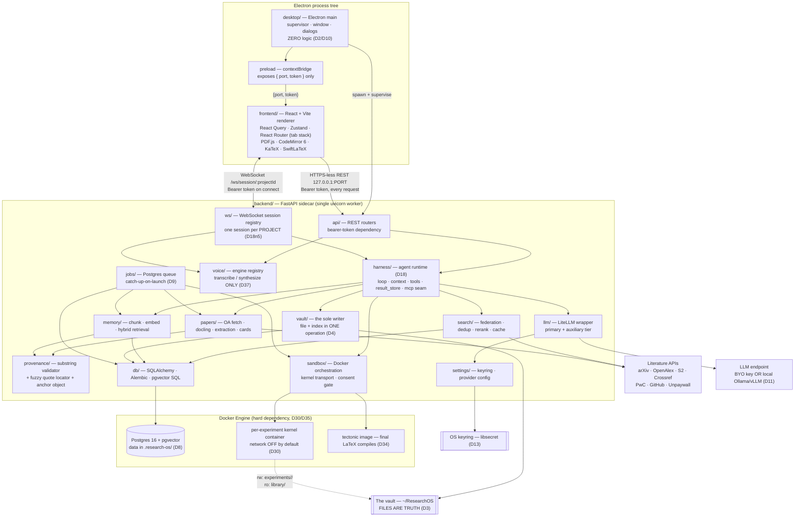
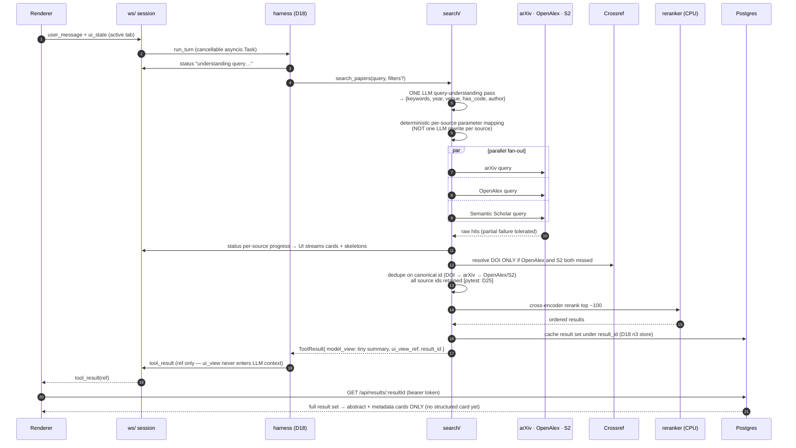
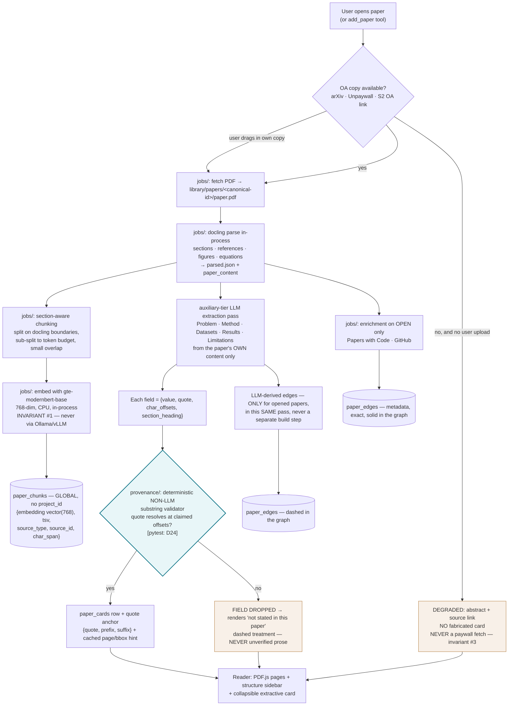
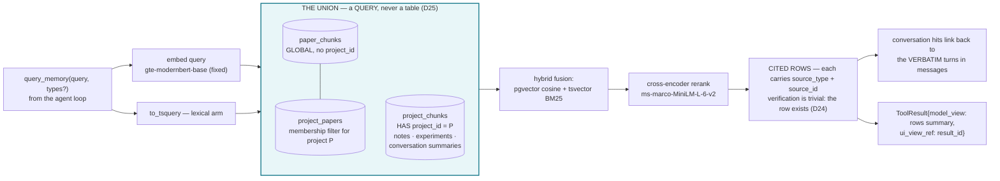
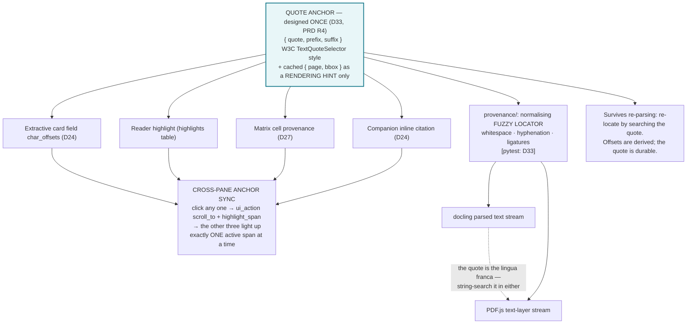
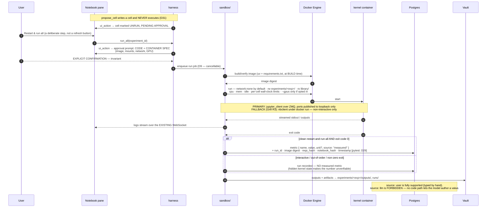
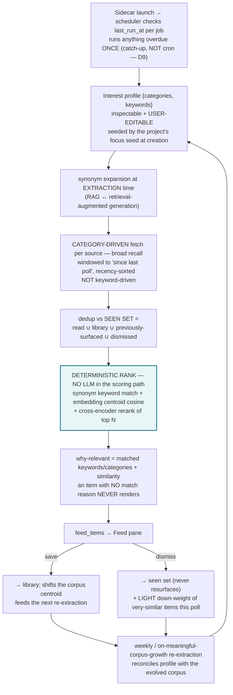

# TRD — Research Companion OS (v1)

**Authority.** `DECISIONS.md` (D1–D37) owns the stack. This document does not choose technology; it
restates the locked choices in implementation-level technical detail and specifies the runtime
mechanics the decisions imply. Where a line here traces to a decision, the decision ID is cited.
`DECISIONS.md` **Appendix A** lists 18 retired paths — none of them appear here, and none may be
re-proposed.

**Vocabulary.** Build units are **Phase 1 … Phase 5** plus the cross-cutting **Voice** layer. The
word "Slice" is retired; `DECISIONS.md` D5/D19/D29/D36 "Slice N" reads as "Phase N".

**Five invariants (locked, non-configurable):** (1) fixed embedding model `gte-modernbert-base`;
(2) no Claude/ChatGPT subscription as LLM access; (3) never fetch paywalled PDFs; (4) all code
execution in Docker with no opt-out; (5) the agent never executes code without explicit user
approval.

---

## 1. Tech Stack

Single-user, Linux-only desktop application. One machine, one OS user, no server, no hosting.

### 1.1 Desktop shell

| Concern | Choice | Detail |
|---|---|---|
| Shell | **Electron** (main + preload), `desktop/` | Spawns and supervises the Python sidecar, owns the BrowserWindow, native file dialogs, tray, app lifecycle. **~300 lines, zero business logic** (D2, D10). |
| Renderer | **Chromium**, pinned by Electron | Guarantees the exact engine PDF.js, KaTeX and SwiftLaTeX WASM are tested against. |

**Electron over Tauri (D2).** Tauri delegates rendering to the system webview (WebKitGTK on Linux),
which makes PDF.js text-layer geometry, KaTeX and SwiftLaTeX WASM behaviour a function of the host's
webkit2gtk version. This app's three most load-bearing renderer features are exactly those. A pinned
Chromium costs bundle size, which is irrelevant for a `git clone` self-install on one Linux machine.

**`desktop/` must stay dumb (D10).** It may call: spawn sidecar, kill sidecar, open file dialog,
show window, pass `{port, token}` to the preload. Anything else is a boundary violation. This is the
single failure mode to watch for during the build.

### 1.2 Backend sidecar

| Concern | Choice | Detail |
|---|---|---|
| Language | **Python 3.11+** | Non-negotiable: docling, `sentence-transformers`, torch, LiteLLM, `jupyter_client` are all Python. Electron is Node and cannot execute Python — this is a **language boundary, not a preference** (D2). |
| Web framework | **FastAPI** + **uvicorn** | Async-native (D18 node 7 needs a real event loop), Pydantic-typed, and emits an OpenAPI schema that generates the TS client (D10). Chosen over Flask/Django: Flask has no first-class async or schema generation; Django brings an ORM/admin/auth stack that is dead weight in a no-auth single-user app (D6). |
| Validation / models | **Pydantic v2** | The OpenAPI schema is downstream of these models, so the TS client is downstream of them too. |
| ASGI server | **uvicorn**, single worker | One worker, always. Multiple workers would fragment the in-process WebSocket session map, the result store and the lazily-loaded ML models. Concurrency comes from asyncio, not processes. |
| Package manager | **uv** | Also used inside the experiment image for `requirements.txt` layering (D30). |

**No Next.js / no server-rendered framework (D6).** API-first was chosen so the UI and the backend
stay independently replaceable — a choice that paid off literally at the desktop pivot, where the
React build and the FastAPI app were unchanged and Electron simply wrapped them.

### 1.3 Frontend

| Concern | Choice | Detail |
|---|---|---|
| Framework | **React 18 + TypeScript** | (D6) |
| Build | **Vite** | Fast HMR against a loopback sidecar; produces a static bundle Electron loads from disk. |
| Router | **React Router** | URL owns project + a **stack of open center-pane routes with exactly one active** (D32 as amended by PRD Grill R5). |
| Server state | **React Query** | Cache/invalidate/loading for every REST resource; invalidated by `tool_result` events off the WS bus (D32). |
| Local UI state | **Zustand** | The store **is** the `ui_state` payload sent up the WebSocket (D18 node 5, D32). |
| PDF | **PDF.js** | Real pages — figures, equations, layout intact. Never reflowed prose (D33). |
| Code / LaTeX editor | **CodeMirror 6** | One editor for both notebook cells and LaTeX. Monaco is retired (Appendix A) — a second heavy editor for a familiarity gain that does not matter at this scale (D32, D34). |
| Math | **KaTeX** | Live inline math in the LaTeX editor (D34). |
| LaTeX preview | **SwiftLaTeX (WASM)** in the renderer, default | Instant debounced preview with no container spin-up per keystroke (D34). |
| LaTeX escape hatch | **Tectonic in Docker** | Final compiles needing full package coverage. Docker is already a hard dependency, so this costs one image (D34). |
| Graph canvas | **Cytoscape.js** or **react-force-graph** | D26 leaves this open; pick at Phase 3 build time. This is the only genuinely open frontend choice, and it is deliberately deferred by decision. |
| Styling | CSS custom properties from `UI_DESIGN.md` §1 | Light-only, single theme. Tokens live in `frontend/src/design/`. |
| API client | **`packages/api-client`**, generated from FastAPI's OpenAPI schema | Regenerated on every backend change; a backend field rename becomes a **frontend compile error**, not a runtime `undefined` (D10). |

### 1.4 Data layer

| Concern | Choice | Detail |
|---|---|---|
| Database | **PostgreSQL 16 + pgvector**, in Docker | One store for everything: `pgvector` for dense retrieval, `tsvector` for BM25, join tables + recursive CTEs for the knowledge graph, JSONB for paper metadata and interest profiles (D7). |
| Why Postgres-in-Docker | **Docker is already a hard dependency for D30.** Adding Postgres to compose adds one container and zero new concepts, and keeps D7/D9/D25 retrieval byte-for-byte unchanged (D8). |
| Retired alternatives | SQLite + `sqlite-vec`, embedded Postgres binaries (`pgserver`) | Both would have forced a rewrite of the hybrid pgvector/tsvector retrieval **and** the Postgres job queue, to dodge a dependency already paid for (Appendix A). |
| No second datastore | No Qdrant, no Neo4j, no Redis | Split a store out only when a query **measures** slow — it will not at solo-researcher volumes (D7, D9). |
| Migrations | **Alembic** | Schema shapes live in `Schema.md`; Alembic owns their application. |
| DB access | **SQLAlchemy 2.x async** + `asyncpg`; raw SQL for the hybrid-retrieval and recursive-CTE queries | ORM where it helps, hand-written SQL where pgvector operators and CTEs make it clearer. |
| Job queue | **Postgres-backed: SAQ (Postgres backend) or pgqueuer** | Transactional enqueue in the same commit as the row it concerns, one less service. **No Redis** (D9). |
| Truth | **The vault folder** (`~/ResearchOS` by default) | Everything outside `.research-os/` is durable user data; everything inside is derived and deletable (D3). |

### 1.5 AI / ML layer

| Concern | Choice | Detail |
|---|---|---|
| LLM abstraction | **LiteLLM** | One `llm.complete()` across 100+ providers; retries, streaming, cost tracking, key routing. **No native provider SDKs in application code** (D12). |
| Providers (remote, BYO key) | Google, Groq, OpenAI, Anthropic, OpenRouter, DeepSeek, Custom OpenAI-compatible base URL | (D11) |
| Providers (local, first class) | **Ollama** and **vLLM** as *named* entries, not buried under "Custom" | Base URL, **no API key, and the UI must not demand one**; models are **discovered** by querying the endpoint, never typed (D11). LiteLLM speaks `ollama/*` natively and reaches vLLM via its OpenAI-compatible endpoint, so this is configuration, not architecture (D12). |
| Embeddings | **`Alibaba-NLP/gte-modernbert-base`** — 768-dim, English, 8192 ctx, CPU, in-process via `sentence-transformers` | **Invariant #1. Fixed forever, not configurable, never routed through Ollama/vLLM even when a local server is running** (D14). |
| Reranker | **`cross-encoder/ms-marco-MiniLM-L-6-v2`** | Swappable, sits in the request path; upgrade to `bge-reranker-v2-m3` with a GPU. Swapping requires **no reindex** (D15). |
| PDF parsing | **docling**, in-process Python | Sections, references, figures, equations. GROBID-as-a-service returns only if docling's reference extraction proves insufficient (D15, D23). |
| Dev/default LLM | Gemini 2.5 Flash (free tier); Groq Llama 3.3 70B fallback; auxiliary tier Gemini Flash-Lite | Build target only — users bring anything (D15). |
| STT | **`faster-whisper`** (CTranslate2), `base.en`, int8; `whisper.cpp` fallback | ~150 MB cached in `.research-os/`. Behind the D37 boundary; **stub engine ships first** (D37). |
| TTS | **Piper**; `speech-dispatcher` zero-install fallback | Same boundary, same stub-first order (D37). |

### 1.6 Secrets

**OS keyring via the `keyring` package against `libsecret`** (D13). The master key lives in the
keyring; provider keys are stored encrypted (AES-256-GCM) in the single-row local settings store,
decrypted **in memory at call time only**. Never in the vault, never in the repo, never logged. The
UI renders `…last4` only. Keys are validated on save with a live test call.

*(D13 records an open question — whether the AES layer is redundant now that key and ciphertext sit
on the same single-user disk with no network service. It works as specified; not urgent.)*

### 1.7 Testing

Per-phase **manual acceptance checklists** (PRD §13) are the primary gate. **pytest** covers exactly
four points where correctness is invisible to the eye:

| Suite | Covers |
|---|---|
| D24 provenance substring validator | A claimed quote resolves at the claimed offsets, or the field is dropped to `not stated`. |
| D25 canonical-id dedup | DOI → arXiv → OpenAlex/S2 priority, each path plus collision cases. |
| D33 fuzzy quote locator | Whitespace, hyphenation and ligature variants locate across both docling text and the PDF.js text layer. |
| D29 `measured` gate | `source: measured` only from a clean restart-and-run-all that exited 0, always carrying `run_id`, image digest, reqs hash, notebook hash, timestamp. |

**No coverage target, no CI service, no broader test strategy.** These four exist because a human
cannot eyeball them; everything else a human can.

---

## 2. System Architecture Overview

Four layers, one machine, all traffic on loopback.

| Layer | Package | Responsibility | Talks to |
|---|---|---|---|
| **Shell** | `desktop/` | Process supervision, window, native dialogs, `{port, token}` handoff. Zero logic (D2, D10). | Sidecar (spawn/signal), renderer (preload IPC) |
| **Renderer** | `frontend/` | The window. Captures input and UI state, renders events. **No business logic on the client** (D17). | Sidecar over HTTP + WS on loopback |
| **Sidecar** | `backend/` | Everything real: the harness, retrieval, parsing, embedding, Docker orchestration, the vault writer, the job queue. **The single core** (D17). | Postgres, Docker Engine, literature APIs, LLM endpoint, the vault |
| **Index** | Postgres + pgvector container | Machine-derived data only. Rebuildable (D8). | Sidecar only |
| **Truth** | The vault folder | Files on disk. The sidecar is the sole writer (D3, D4). | Sidecar only |

### 2.1 Component topology



### 2.2 Process topology and lifecycle

**Launch sequence (D2, D8, D9, D35).**

1. Electron main starts. It generates a **per-launch bearer token** (`secrets.token_urlsafe(32)`
   equivalent, cryptographically random, regenerated every launch, never persisted).
2. Main spawns the sidecar as a child process, passing the token by environment variable. The
   sidecar binds **`127.0.0.1` on an ephemeral port (port 0)** and prints the bound port on stdout;
   main reads it. Binding to `0.0.0.0` is a bug, not a configuration option.
3. **Main shows the BrowserWindow immediately.** First paint does not wait for the sidecar. The
   renderer renders the shell plus the readiness strip.
4. Preload exposes `{port, token}` to the renderer over `contextBridge` — the only thing crossing
   the IPC boundary. `nodeIntegration: false`, `contextIsolation: true`.
5. The sidecar, in order: reads/creates the vault layout → `docker compose up -d` for
   Postgres+pgvector under `.research-os/` → waits on the compose healthcheck → runs Alembic
   migrations → starts the job-queue worker → runs the **catch-up-on-launch** scheduler pass →
   returns readiness. **ML models are not touched in this sequence.**
6. The renderer polls/streams `GET /api/health` and paints per-capability readiness.

**Why the token is mandatory (D2).** Loopback is not an authorization boundary. Any local process —
including any web page in any browser, via a `fetch` to `127.0.0.1` — can reach an open localhost
port. Every REST request and the WebSocket upgrade carry
`Authorization: Bearer <token>`; a request without it gets `401` before any router runs. The token
is the entire access-control system. **There is no user auth** — the OS login is the auth boundary
(D1). No `users` table, no `owner_id`, no JWT, no RLS.

**Per-capability readiness (D2).** `GET /api/health` returns a capability map, not a boolean:

| Capability | Ready when | Blocks |
|---|---|---|
| `vault` | Vault path resolved and writable | Notes, tree, everything file-backed |
| `database` | Compose healthcheck green, migrations applied | All persisted reads |
| `docker` | Daemon reachable | Experiments, Postgres, Tectonic |
| `llm` | A validated provider config exists | The Companion |
| `search` | `database` + `llm` | Federated search |
| `embeddings` | torch + `gte-modernbert-base` loaded | Semantic memory queries only |
| `reranker` | Cross-encoder loaded | Rerank stage (search degrades to fused hybrid order) |
| `voice` | `backend/voice/` engine registered | Push-to-talk |

**Lazy ML loading (D2).** Importing torch and loading the embedding model costs 5–15 s. It happens
in a `run_in_executor` task on first *use*, guarded by an `asyncio.Lock` so concurrent first-callers
await one load. **Search, notes and the vault tree are usable before `embeddings` is ready.** The
same rule applies to the reranker and — per D37 — the STT model, which must not load until the first
push-to-talk press.

**Shutdown.** Electron `before-quit` → sidecar `SIGTERM` → FastAPI lifespan shutdown: cancel
in-flight turn tasks, stop kernel containers, drain the queue worker, close the pool. Postgres is
left running (compose `up -d`) so the next launch is fast; `make down` stops it. If the sidecar does
not exit within a grace window, main sends `SIGKILL`.

**Escape hatch (D2).** If cold start irritates in daily use, the sidecar may be run as a **systemd
user service** so it stays warm; Electron then detects a live sidecar (via a lockfile carrying port
and token in `.research-os/`) and **attaches** instead of spawning. This is an opt-in operational
convenience, not a second architecture — the supervision code is the only thing that branches.

**Distribution (D2).** `git clone` + `make dev`; updates are `git pull` + rebuild. No AppImage, no
installer, no signing, no notarization, no auto-update, no cross-OS build. Out of scope by decision.

### 2.3 Fat backend, thin frontend (D17)

The sidecar thinks, stores and runs the loop. The frontend captures input and UI state and renders
events. Concretely, the frontend may **not**: decide which tool to call, assemble LLM context,
validate provenance, rank results, re-derive a `ui_view`, or hold authoritative state that the
sidecar does not also hold. Two hard rules follow:

- **The model gets tiny summaries; the client pulls scoped payloads lazily by id** (D18 node 3).
- **Anything the user can click, the Companion can call, and both resolve to the same tool call and
  the same route transition** (D16/D17/D18). No UI-only capability the agent cannot reach; no agent
  capability with no UI surface.

### 2.4 The harness runtime (D18)

`backend/harness/` is a **self-contained, extractable package**. Nothing outside it may import its
internals except through its public entry point. Seven nodes:

**Node 1 — Control loop.** A single-agent tool-calling loop. Subagents exist **only as tools** (e.g.
a future `deep_research`), never as top-level orchestration. A **hard iteration cap of ~8–10** with a
**graceful stop**: on hitting the cap the loop emits a final assistant message explaining it stopped,
not an exception. This is a latency/cost budget, accepted as such (PRD anti-goals).

**Node 2 — Context assembly.** Hybrid, in `harness/context.py`:

- *Ambient, always-on, deterministic:* system prompt + provenance rules, tool schemas, **live
  UI/workspace state** (the Zustand snapshot, including the active tab), and a compact **working
  set** of active items as ids and titles.
- *Deep memory, demand-driven:* `query_memory` returning **cited rows**.
- *Compaction* past a token budget. Compaction is a **window operation, not forgetting** — full
  history always remains in `messages`. **Eviction order is fixed: working set → history → per-turn
  retrieval. System prompt, tool schemas and UI state are never evicted.**

**Node 3 — Tool layer.** Every tool returns the dual-channel `ToolResult`:

```python
class ToolResult(BaseModel):
    model_view: str                 # tiny summary — the ONLY field entering LLM context
    ui_view_ref: str | None         # id into the server-side result store
    refs: list[Ref]                 # stable ids the model can manipulate as handles
    ui_actions: list[UIAction]      # UI commands emitted outward
```

`ui_view` — the rich renderable payload — is **written to the server-side result store keyed by
`result_id`, and never enters LLM context**. The model manipulates handles. The frontend receives
only the ref on the wire and fetches the payload with `GET /api/results/:resultId`. Taxonomy:
**Query / Action / MCP-bridged**, one contract for all three. **Native-first**: the MCP adapter is
built as the extension seam and **zero MCP servers ship in v1** (D19).

The **result store** lives in Postgres (D7 — no Redis), keyed by `result_id`, with the payload as
JSONB and a session/TTL scope. It is a cache: losing it costs a re-fetch, never data.

**Node 4 — Memory.** See §3.3. The key contract: memory(P) is the **query-time union**
`paper_chunks(papers in P) ∪ project_chunks(P)` — a query, never a table (D25). Write path is
hybrid: explicit artifacts are user-authored ground truth; conversations persist **verbatim plus a
summary-as-index** and recall links back to the verbatim turns; **no AI-invented standalone fact is
ever written to memory**. Memory is user-visible and editable.

**Node 5 — I/O.** One WebSocket per project over loopback. **Event names below are verbatim from
D18 node 5 and are the wire contract:**

*Down:* `status` · `text_delta` · `tool_call` · `tool_result` (ref only) · `ui_action` ·
`turn_complete` · `error`
*Up:* `user_message` · `ui_state` · `interrupt`

Every `user_message` carries a **UI-state snapshot including the active tab**; incremental
`ui_state` pushes may arrive mid-turn and are merged into ambient context for the next iteration of
the same turn. **Interrupt is first class** — see node 7.

**Node 6 — Model & turns.** Pure agent, no hardwired intent classifier or regex fast path (D16 — the
~15-intent table is retired, Appendix A). **Primary + optional auxiliary model tier**: the user sets
a primary chat model; auxiliary tasks (extraction, summarisation, interest classification) default
to a cheaper model and fall back to primary when none is set. A **prompted-structured-output
fallback** handles models without native tool-calling — this is load-bearing, not a nicety, because
tool-calling quality varies wildly across local models (D11). Embeddings and reranking are non-LLM
and never go through this path.

**Node 7 — Runtime shape.** One **cancellable `asyncio.Task` per turn**, bound to the WebSocket
session:

```python
session.current_turn = asyncio.create_task(harness.run_turn(...))
# on `interrupt` from the client:
session.current_turn.cancel()          # raises CancelledError at the next await point
# the loop catches it, flushes partial results, emits turn_complete(interrupted=True)
```

**This task is what makes interrupt real.** Cancellation is cooperative and lands at an `await`
boundary; the loop catches `CancelledError`, persists whatever the turn already produced (partial
assistant text, completed tool results), and emits `turn_complete` with an interrupted marker.
**Partial results are retained**, never rolled back. Only one turn per session may be in flight; a
`user_message` arriving mid-turn is rejected or queued explicitly, and the composer tells the user
which (PRD §6 additional states).

I/O-bound steps are `await`ed inline. **CPU-bound steps — embed, parse, rerank — are offloaded to
the D9 job queue and never block the event loop.** Turn state is in-process but persisted
incrementally, so a crash mid-turn loses the loop, not the transcript.

### 2.5 Routing and the tab stack (PRD Grill R5, overriding `UI_DESIGN.md` §2)

The URL owns the project plus a **stack of open center-pane routes with exactly one active** — not a
single center-pane URL. This restates D32's routing statement for tabs.

- Serialization: the active route is the browser URL; the full stack is a companion structure
  persisted to the local settings store, keyed by project.
- **Tab state persists across app restart.** It is real state, not view-local ephemera. On launch
  the router rehydrates the stack, then activates the previously-active tab.
- **The reader supports multiple papers open simultaneously**, each independently scrolled.
- `ui_action` events (`open_paper`, `open_view`) push onto the stack rather than replacing the
  center pane; `scroll_to` / `highlight_span` target the tab that owns the referenced paper,
  activating it if it is already open and opening a tab if it is not.
- **The Companion remains one WebSocket session per project, not per tab.** It does not switch
  sessions when the active tab changes. The active tab is reported in the `ui_state` payload
  (D18 node 5). Chat and nav are persistent shell, not routes (D32).

### 2.6 Voice architecture (D36, D37)

Voice is a **thin transport over the tool layer**. It produces text and consumes text; **the agent
cannot tell how a turn arrived** — a spoken turn and a typed turn hit the same session, the same
tools, the same memory, with no separate code path.

**`backend/voice/` is a self-contained package with exactly two public functions:**

```python
def transcribe(audio_bytes: bytes, *, lang: str) -> Transcript: ...
def synthesize(text: str, *, voice: str) -> bytes: ...
```

plus a small **engine registry** — `stub`, `faster_whisper`, `whisper_cpp`, and any future engine —
selected by config. **No module outside `backend/voice/` may import an STT/TTS library, name an
engine, or know that a model exists.** The harness, the WebSocket transport and the UI talk to
`backend/voice/` only. If swapping an engine requires touching anything outside the package, the
boundary is wrong and the fix goes inside the package, not in the caller.

**`frontend/src/voice/` is the mirror module** — microphone capture, push-to-talk key state and
audio playback, exposing **one hook**. No component anywhere else touches `getUserMedia` or an audio
element.

**Push-to-talk only.** No VAD, no idle capture, no microphone opening unprompted. Model files,
engine config and warm-up live inside the module and stay **lazy** — the STT model must not load
until the first talk-key press.

**Build order: infrastructure now, models later.** Ship the boundary plus the **stub engine**
(canned STT text, silence or an OS beep for TTS) wired end to end, then drop `faster-whisper` and
Piper in behind it. This keeps a ~150 MB download and any GPU/CPU tuning off the critical path.
**The real engines are the single droppable piece of v1** — if the spike shows they are too heavy,
they slip post-v1 and nothing else changes.

### 2.7 Execution subsystem (D30, D31)

**Primary path — interactive kernel.**

- **Container is per-experiment and long-lived**, not per-run. It starts when the experiment is
  opened, holds kernel state across cells, and is torn down on close or idle timeout.
- **Base image:** pinned, carrying numpy / pandas / torch / scikit-learn / matplotlib, so a kernel
  starts in ~1 s. Per-experiment dependencies are layered on top via **`uv` + `requirements.txt`**
  from the experiment folder, **at image-build time**.
- **Mounts, exactly:** `projects/<slug>/experiments/<exp>/` read-write; `library/` read-only when
  the run needs paper data. **Nothing else. Never the whole vault, never `$HOME`.**
- **Network off by default** for the kernel (`--network none`). Dependency installation happens at
  image-build time where network is expected and fine. A networked run is an **explicit
  per-experiment opt-in, recorded in the run record**, because a networked run is a less
  reproducible run.
- **Limits:** CPU quota, memory cap, idle timeout, per-cell wall-clock timeout. GPU is opt-in per
  experiment via `--gpus` + nvidia-container-toolkit. **No GPU arbitration** between a resident vLLM
  server and an experiment container — the user stops one by hand (D11, Appendix A).
- **Transport:** `jupyter_client` over ZMQ to a kernel inside the container, with the kernel's ports
  **published to loopback only**. This is the least-proven part of the design and is a hard
  prerequisite of Phase 2. **Spike it before Phase 2 work starts.**
- **Cell execution and kernel lifecycle ride the D9 queue** — cancellable, with logs and outputs
  streaming to the UI over the existing WebSocket, where interrupt is already first class.

**Stated fallback — non-interactive only (PRD Grill R3).** If the kernel transport spike fails,
Phase 2 **descopes rather than slips**: execute the whole notebook in the container via **`nbclient`
under `docker run`**, streaming logs and outputs to the UI over the same WebSocket. Take this as
soon as the spike fails; do not extend the phase.

| Property | Interactive path | `nbclient` fallback |
|---|---|---|
| Mounts, network-off, limits, GPU opt-in | Same | Same |
| Consent gate before any execution | Required | Required |
| Invariants #4 and #5 | Intact | Intact |
| `source: measured` provenance | From clean restart-and-run-all | From the same clean run — **identical** |
| Out-of-order exploration against warm state | Yes | **Lost** — the only casualty |
| Container lifetime | Per-experiment, long-lived | Per-run |

The evidence-producing run was **already defined** as a clean restart-and-run-all, so the fallback
costs only free-form exploration — already classified as the non-evidential half of the workflow.

**Consent (D31, invariant #5).** `propose_cell` writes a cell and **never executes**. `run_all`
**cannot complete without an explicit human confirmation** — it is the only tool in the catalog with
that property, and that is deliberate. The `ui_action` lane carries the approval prompt, which shows
**the code and the container spec (image, mounts, network, GPU)**. Agent-written cells are visually
marked **unrun and pending approval** — the user must never be unsure whether something executed.
There is no auto-run, no trusted-experiment mode, and no blanket per-project approval.

**The sandbox and the consent gate are independent controls and both are required.** Docker limits
what a run can damage; it says nothing about whether the run should have happened. The realistic
attack — a prompt-injected paper persuading the agent to write and execute something — is stopped by
the gate, not by the container.

### 2.8 The vault writer (D3, D4)

`backend/vault/` is the **sole writer** of the vault, and may assume so.

- **File write and index update happen in one operation.** Disk and DB cannot drift. Order: write
  the file, then update the index inside the same DB transaction, committing only after the file
  write succeeds; a failed index update rolls back and reports rather than leaving a half-state.
- **Notes are keyed in the DB by a stable YAML-frontmatter id, never by file path.** Moving a file
  must not break a highlight, a graph edge or a citation. This is the one piece deliberately
  retained from the retired external-editing design, because it is the only part that is painful to
  retrofit — path-keyed rows would make conversion a data migration rather than a code change.
- **No file watcher, no debounce, no hash-diffing, no conflict detection, no startup
  reconciliation.** All of it was insurance against external editors, which are not in scope
  (Appendix A).
- **Symlinks, not copies:** `projects/<slug>/papers/` symlinks into `library/papers/<canonical-id>/`.
  One PDF, one parse, one set of embeddings.

### 2.9 Job queue (D9)

Postgres-backed (SAQ on Postgres, or pgqueuer). Jobs: PDF fetch, docling parse, embedding,
structured extraction, feed polling, experiment container runs. Long-running jobs are cancellable
and stream progress to the UI over the existing WebSocket.

**Cadence is catch-up-on-launch, not cron.** A desktop app only runs when the user opens it, so
"daily cron" does not exist as a concept. On startup the scheduler checks `last_run_at` per
scheduled job and runs anything overdue, **once**. This covers feed polling and weekly
interest-profile re-extraction. **One-time setup never sits in a request path.**

---

## 3. Data Flow

### 3.1 Federated search → dedupe → rerank → cached result set

*A natural-language query becomes one LLM understanding pass, a parallel fan-out to three sources,
canonical-id dedup, a cross-encoder rerank of the top ~100, and a `result_id`-keyed cache the
frontend pulls by id.*



**Notes.** Papers with Code and GitHub are **not** called on search — only on paper *open* (D21). A
single source failing degrades the page and names what still worked; it never blanks it.

### 3.2 Paper open → OA fetch → docling parse → extraction → validated card

*Opening a paper runs a queued global pipeline once per canonical id, and no card field is ever
displayed unless a deterministic non-LLM validator confirms its quote resolves in the parsed source.*



**Global by construction.** Everything in this pipeline is keyed by canonical paper id and computed
**once, ever** (D22, D25). Adding the same paper to a second project creates a `project_papers`
membership row and a symlink — **no re-parse, no re-embed**.

### 3.3 Project memory query — the query-time union

*`query_memory` runs hybrid dense + lexical retrieval over the union of the project's papers'
global chunks and the project's own chunks, reranks, and returns rows that each cite their source
row id.*



**Isolation guarantee.** Project isolation comes from the **membership filter**, not from duplicated
data. Results from another project can never appear, and paper embeddings are still computed once
globally and reused. **In v1 the structured experiment record is indexed; the `.ipynb` file itself
is not embedded** (D29) — so `query_memory` finds "the experiment where I tried X" but not a
specific line of notebook code. The notebook stays a plain, greppable file in the vault.

### 3.4 The shared quote anchor — one object, four consumers

*A single content-addressed anchor object serves the extractive card's `char_offsets`, the reader
highlight, the matrix cell's provenance and the Companion citation, and bridges the two independent
text streams.*



### 3.5 Experiment run → measured metric

*The only path in the system to `source: measured` — an explicitly approved, clean
restart-and-run-all in a container that exits 0, carrying its own reproducibility fingerprint.*



### 3.6 Research feed — catch-up-on-launch, no LLM in the scoring path

*A scheduled per-project job that fetches broadly by category since the last poll and ranks
deterministically, so every surfaced item can state why it surfaced.*



**Never in a live request path.** The feed is a scheduled harness job. Full negative-example learning
is post-v1; v1 is the light down-weight only (D28).

---

## 4. API Design

Two surfaces, both on `127.0.0.1` at an ephemeral port, both requiring
`Authorization: Bearer <per-launch-token>`. There is **no user auth** — "Auth" below always means
that token (D1, D2). Types below are the Pydantic shapes; `packages/api-client` is generated from
the resulting OpenAPI schema and **regenerated on every backend change** (D10).

### 4.1 WebSocket — `/ws/session/:projectId`

One session **per project**, surviving center-pane navigation **and tab switches**. The token is
supplied on the upgrade request; an unauthenticated upgrade is refused before the session is
created.

**Downstream events** (names verbatim, D18 node 5):

| Event | Payload | Purpose |
|---|---|---|
| `status` | `{ text }` | Live status line ("reading paper…", per-source search progress). |
| `text_delta` | `{ delta }` | Streaming assistant text. |
| `tool_call` | `{ call_id, tool, args_summary }` | Renders the tool chip in the running state. |
| `tool_result` | `{ call_id, model_view_summary, ui_view_ref, refs[] }` | **Ref only.** The rich `ui_view` is fetched by id and never sent through LLM context. |
| `ui_action` | `{ action, params }` — `open_paper` · `scroll_to` · `highlight_span` · `open_view` | Drives the router and the tab stack. Also carries the run-approval prompt (D31). |
| `turn_complete` | `{ turn_id, interrupted: bool, iterations }` | End of turn; `interrupted: true` after a cancel, with partial results retained. |
| `error` | `{ code, message, recoverable, what_still_worked }` | Feeds the error card, which must say what still worked. |

**Upstream events:**

| Event | Payload | Purpose |
|---|---|---|
| `user_message` | `{ text, ui_state: UIState }` | A user turn **plus a full UI-state snapshot including the active tab**. |
| `ui_state` | `UIState` (partial) | Incremental UI-state push mid-turn; merged into ambient context. |
| `interrupt` | `{ turn_id }` | Cancels the in-flight `asyncio.Task`. Partial results retained. |

```ts
type UIState = {
  activeTab: TabRef              // required — the tab stack's active entry
  openTabs: TabRef[]             // the persisted stack
  selection?: { paperId: string; anchor: QuoteAnchor }
  openPanes: string[]
  workingSet: Array<{ type: string; id: string; title: string }>
}
type QuoteAnchor = {
  quote: string; prefix: string; suffix: string
  hint?: { page: number; bbox: [number, number, number, number] }
}
type Relevance = "relevant" | "somewhat" | "not" | "unset"   // wire values — see §4.2
```

**Reconnection.** A dropped socket surfaces `disconnected` / `reconnecting` states, and the composer
must state whether a queued message will send. On reconnect the client re-sends a full `ui_state`
snapshot; the transcript is rehydrated from `conversations`/`messages`, which hold it verbatim.

### 4.2 REST surface

| Method | Path | Purpose | Request | Response |
|---|---|---|---|---|
| GET | `/api/health` | Per-capability readiness for the cold-start strip | — | `{ capabilities: Record<Capability, "pending"\|"ready"\|"failed">, detail }` |
| GET · POST | `/api/projects` | List / create projects | `{ name, focus_seed? }` | `Project` |
| GET | `/api/projects/:id` | Project detail + persisted tab stack | — | `Project` |
| POST | `/api/search` | Federated search (D20/D21) | `{ query, filters? }` | `{ result_id, results: PaperSummary[] }` |
| POST | `/api/search/refine` | Re-filter a cached result set | `{ result_id, filters }` | `{ result_id, results[] }` |
| GET | `/api/results/:resultId` | Fetch a cached result set / any tool `ui_view` by id | — | `ResultSet` (JSONB payload) |
| POST | `/api/projects/:id/papers` | Add a paper by link, id, or upload | `{ link \| source_id \| upload_ref }` | `Paper` |
| GET | `/api/papers/:paperId` | Paper record | `?include=card,sections,references,datasets,code` | `Paper` |
| GET | `/api/papers/:paperId/pdf` | PDF bytes from the vault | — | `application/pdf` |
| GET | `/api/papers/:paperId/status` | Per-paper processing state | — | `{ fetch, parse, embed, extract }` each `queued\|running\|done\|failed\|degraded` |
| PATCH | `/api/projects/:id/papers/:paperId` | Relevance + why-relevant note | `{ relevance: "relevant"\|"somewhat"\|"not"\|"unset", why? }` | `ProjectPaper` |
| GET · POST · PATCH | `/api/projects/:id/notes` | Notes CRUD — **writes file + index in one operation** | `{ frontmatter_id?, title, body }` | `Note` |
| POST | `/api/projects/:id/highlights` | Create a quote anchor | `{ paper_id, anchor: QuoteAnchor }` | `Highlight` |
| POST | `/api/projects/:id/memory/query` | Hybrid retrieval → reranked **cited rows** | `{ query, types? }` | `{ rows: CitedRow[] }` |
| GET · POST · PATCH | `/api/projects/:id/experiments` | Experiment record CRUD | `Experiment` partial | `Experiment` |
| POST | `/api/experiments/:id/kernel` | Start / stop the per-experiment kernel container | `{ action: "start"\|"stop" }` | `KernelStatus` |
| POST | `/api/experiments/:id/propose_cell` | Write a cell, **never execute** | `{ code, index? }` | `Notebook` |
| POST | `/api/experiments/:id/run_all` | **Requires explicit user confirmation.** The only path to `source: measured` | `{ confirmation_token, network_optin?: bool, gpu?: bool }` | `{ run_id }` |
| GET | `/api/runs/:runId` | Outputs, logs, exit code, image digest, hashes | — | `Run` |
| GET · PUT | `/api/projects/:id/matrix/:matrixId` | Matrix definition, overrides, custom-column cache | `{ selected_paper_ids, column_defs, cell_overrides }` | `Matrix` |
| GET | `/api/projects/:id/graph` | Project-scoped edge union, typed + provenance-tagged | `?types=` | `Graph` (`edge.provenance: "metadata"\|"llm"`) |
| GET · POST | `/api/projects/:id/documents` | LaTeX drafts; compile + BibTeX export | `{ tex, engine?: "swiftlatex"\|"tectonic" }` | `Document` \| `CompileResult` |
| POST | `/api/projects/:id/documents/:docId/check_citations` | Missing / unsupported citation checks | — | `{ findings[] }` |
| GET · POST | `/api/projects/:id/feed` | Feed items; save / dismiss | `{ action, item_id }` | `FeedItem[]` |
| GET · PUT | `/api/projects/:id/interest-profile` | Inspectable, editable profile | `{ categories[], keywords[] }` | `InterestProfile` |
| GET · PUT | `/api/settings/models` | Provider keys (write-only; `…last4` on read), primary + auxiliary model. **Validates on save with a test call** | `ModelSettings` | `ModelSettings` |
| GET | `/api/settings/models/discover` | Query a local endpoint for its available models — **never make the user type a model string** | `?provider=ollama\|vllm&base_url=` | `{ models[] }` |
| GET · PUT | `/api/settings/tabs` | Persisted tab stack per project | `{ project_id, tabs[], active }` | `TabStack` |
| POST | `/api/voice/transcribe` | **The only STT endpoint** — engine-agnostic (D37) | `audio/*` bytes, `?lang=` | `Transcript` |
| POST | `/api/voice/synthesize` | **The only TTS endpoint** — engine-agnostic (D37) | `{ text, voice? }` | audio bytes |

**Relevance enum — these are wire values, not display strings.** The four-value enum is exactly
`relevant | somewhat | not | unset` on the wire, in the DB and in the generated TS client (D22, D25,
`Schema.md`, PRD §13). **UI copy maps `not` → "not relevant" and `unset` → "unmarked"**; rendering
the raw value `unset` in the reader's segmented control is a bug, not a shortcut (`UI_DESIGN.md`
§3.2, §9.2 D). This distinction is load-bearing because the TS client is generated from FastAPI's
OpenAPI schema (D10), so these strings become compile-time types in `packages/api-client/` — a
display string leaking into a payload propagates into the frontend rather than failing loudly.

**Errors.** A uniform error envelope `{ code, message, recoverable, what_still_worked }` — the last
field exists because the error card is required to say what still worked (PRD §6). `danger` is for
errors only and is never a status value; there is no "failed" experiment status.

### 4.3 Tool catalog (D19) — the third interface

The tool catalog is designed **once** in v1 and consumed by every phase (PRD R4). It is the surface
the Companion, the UI and voice all resolve to. **Q** = Query, **A** = Action.

| Phase | Tool | Kind | Returns / effect |
|---|---|---|---|
| 1 | `search_papers(query, filters?)` | Q | `result_id` + summaries |
| 1 | `refine_results(result_id, filters)` | Q | narrowed set |
| 1 | `add_paper(link\|id\|upload_ref)` | A | `Paper` |
| 1 | `get_paper(paper_id, include=[card\|sections\|references\|datasets\|code])` | Q | one parameterised tool, not five |
| 1 | `compare(paper_ids[])` | Q | cross-paper cited comparison |
| 1 | `open_reference(paper_id, ref_id)` | A | resolves + opens |
| 1 | `query_memory(query, types?)` | Q | **cited rows** |
| 1 | `save_note` / `update_note` | A | file + index in one operation |
| 1 | `mark_relevant(paper_id, level)` | A | `level` is the wire enum `relevant\|somewhat\|not\|unset` |
| 1 | `create_highlight(paper_id, anchor)` | A | quote anchor |
| 1 | `log_experiment` / `update_experiment` | A | structured record |
| 1 | `open_paper` · `scroll_to` · `highlight_span` · `open_view(matrix\|graph\|feed\|experiments)` | A | emit `ui_actions` |
| 2 | `propose_cell(experiment_id, code)` | A | writes a cell, **never executes** |
| 2 | `run_all(experiment_id)` | A | **requires explicit user confirmation**; the only path to `source: measured` |
| 2 | `read_run(run_id)` | Q | outputs and logs |
| 3 | `build_matrix` · `update_cell` | A | matrix artifact |
| 3+ | `get_graph` · `find_related` | Q | project-scoped union |
| 4 | `insert_citation` · `check_citations` · `find_missing_citations` | A/Q | citations only — **never prose** |
| 5 | `get_feed` · `save_feed_item` · `dismiss_feed_item` · `get_interest_profile` · `update_interest_profile` | Q/A | feed + profile |

**Design rules (D19).** Reader Q&A is **not a tool** — it is the core agent loop answering from
ambient UI state plus retrieval tools. **There is no `ask_paper` tool.** Prefer moderate-fat
parameterised tools over many thin ones. The **MCP adapter is built as the extension seam and zero
MCP servers ship in v1**.

---

## 5. Non-Functional Requirements

**Scope note.** Multi-tenancy, horizontal scale, uptime SLAs, ops burden, code signing,
notarization, packaging and cross-OS support are **out of scope by decision** (D1, D2) and therefore
generate no requirement here.

### 5.1 Performance

| Target | Value | Rationale |
|---|---|---|
| First paint | **Immediate** — the window paints before the sidecar is ready | Electron shows the window and the readiness strip on launch (D2). |
| ML model load | 5–15 s, **lazy, off the first-paint path** | Search, notes and the vault tree must be usable before `embeddings` is ready (D2). |
| Kernel cold start | ~1 s | The pinned base image already carries numpy/pandas/torch/sklearn/matplotlib (D30). |
| LaTeX preview | ~1–2 s after a debounced edit | SwiftLaTeX WASM in the renderer, no container spin-up per keystroke (D34). |
| Agent turn | **Not a latency target.** ~8–10 iterations with a graceful stop is the budget | Explicitly an anti-goal; a routing model is post-v1 (D16, PRD §2). |
| Federated search | Bounded by the slowest source; per-source progress streams | Live federation, no owned index — accepted tradeoff (D20). |
| Embedding / parse / rerank | Async on the D9 queue, **never on the event loop** | CPU-bound work is offloaded by rule (D18 node 7). |
| Loading UX | Progressive reveal, **never a single blocking spinner** | Real cards and shimmer skeletons side by side (PRD §6). |
| Responsive floor | Usable at ~1280 px; nav collapses to icons **before** the Companion is ever dropped | Dropping the Companion breaks the product premise (`UI_DESIGN.md` §7). |
| Index rebuild | Minutes to hours, stated honestly | Deleting `.research-os/` costs **time, never data** (D3). |

### 5.2 Security

The threat model is not the user's own scripts. It is that **the agent writes and runs code, and the
agent reads PDFs from the open internet.** A prompt-injected paper that talks the agent into running
something is a realistic path to arbitrary code execution on the user's machine (D30).

| Control | Requirement |
|---|---|
| Network exposure | Sidecar binds `127.0.0.1` on an ephemeral port. **Never `0.0.0.0`.** |
| Access control | Per-launch bearer token, **mandatory on every REST request and on the WebSocket upgrade**, regenerated every launch, never persisted. Loopback alone is not an authorization boundary — any local process or web page can reach a localhost port (D2). |
| User auth | **None, by decision.** The OS login is the auth boundary. No `users`, no `owner_id`, no JWT, no RLS (D1, Appendix A). |
| Secrets | Master key in the OS keyring (`libsecret`); provider keys AES-256-GCM encrypted, decrypted in memory at call time only. Never in the vault, the DB in plaintext, the repo, or logs. `…last4` in the UI (D13). |
| Code execution | **All code runs in a Docker container, always, no opt-out** (invariant #4). No code path executes user or agent code on the host. |
| Consent | **The agent never executes code without explicit user approval** (invariant #5). Sandbox and gate are independent controls; both required. No auto-run, no trusted mode, no blanket approval (D31). |
| Container isolation | `--network none` by default; mounts exactly `experiments/<exp>/` rw and `library/` ro — never the whole vault, never `$HOME`; CPU, memory, idle and per-cell wall-clock limits; GPU opt-in per experiment. |
| Kernel transport | ZMQ ports published to **loopback only**, never to a host interface. |
| Renderer hardening | `contextIsolation: true`, `nodeIntegration: false`; the preload exposes `{port, token}` and native dialog proxies and nothing else. |
| Content fetching | **Never fetch paywalled PDFs** (invariant #3). OA fetch and user upload only; degrade to abstract + source link with **no fabricated card**. |

### 5.3 Correctness and provenance

These are the app's real non-functional requirements — the ones the product's value rests on.

| Requirement | Enforcement |
|---|---|
| **Zero unverified evidence rendered as verified.** No field or claim is shown as coming from a paper unless a deterministic non-LLM substring validator confirms its quote resolves in the parsed source | Structural, not prompted. Failing fields drop to `not stated`; failing cited spans are stripped and their claim marked `⚠ unverified`. Target: 0 exceptions. **[pytest: D24]** |
| **Zero unearned `measured` metrics.** No metric carries `source: measured` without a linked `run_id`, image digest, `requirements.txt` hash, notebook hash and timestamp from a clean restart-and-run-all that exited 0 | Gate in `sandbox/`; interactive or out-of-order runs can never produce one. **[pytest: D29]** |
| **`source: llm` is impossible.** The model may propose code and read results; it may never author a metric value | No code path exists to write it (D29). |
| **Canonical-id dedup is exact.** DOI → arXiv → OpenAlex/S2, all source ids retained | **[pytest: D25]** |
| **Quote anchors survive re-parsing** and bridge docling text ↔ PDF.js text layer across whitespace, hyphenation and ligature variants | Normalising fuzzy locator, built once. **[pytest: D33]** |
| **Project isolation.** Results from another project never appear | The membership filter in the query-time union (D25). |
| **Disk and DB cannot drift** | File write and index update happen in one operation; the app is the sole writer (D4). |
| **Enum wire values never carry display copy.** e.g. relevance is `relevant\|somewhat\|not\|unset` on the wire | The generated TS client turns these into compile-time types (D10); UI copy maps them at render time only. |

### 5.4 Reliability and degradation

- **Partial source failure degrades, never blanks.** One literature source failing renders the
  results that arrived and names what still worked.
- **Degraded full text** is a first-class state: abstract + source link, no card, no paywall attempt.
- **Per-paper processing states** (`fetch` / `parse` / `embed` / `extract`) are visible on the
  library card and reader header, and **"still extracting" must be visually distinct from "not
  stated"**.
- **Dropped WebSocket** renders disconnected/reconnecting, and the composer states whether a queued
  message will send.
- **Interrupt retains partial results.** Cancelling a turn never rolls back what already completed.
- **Rebuildability:** `.research-os/` may be deleted at any time; the app rebuilds it from the vault.

### 5.5 Accessibility

- **WCAG AA** contrast on all text, including muted text and tinted badges. The `700 10px`
  badge/label is the riskiest combination in the system and **must be checked explicitly before each
  phase sign-off**.
- Full keyboard navigability; a global `:focus-visible` of `2px solid var(--accent)` at `2px` offset
  on **every** interactive element.
- The graph encodes node type by **colour and shape** and edge provenance by **dash** — never colour
  alone. The legend documents both.
- Screen readers must distinguish the Companion transcript's five kinds (user, assistant reasoning,
  cited evidence, tool chip, tool result), and `⚠ unverified` must be **announced**, not just tinted.
- Prose measure caps at 600–640 px regardless of pane width.

### 5.6 Offline behaviour

The app runs with no network for everything except literature search/fetch and a remote LLM
endpoint. **Pointing at a local Ollama or vLLM endpoint makes it fully offline** — embeddings,
reranking, parsing, STT and TTS are all local by design (D11, D14, D15, D37).

---

## 6. Third-Party Integrations

### 6.1 Literature APIs (D21) — three tiers, deliberately

| Tier | Service | When called | Why |
|---|---|---|---|
| **Primary fan-out** | **arXiv** | Every search | OA full text + discovery; the source that actually yields a fetchable PDF. |
| **Primary fan-out** | **OpenAlex** | Every search | Metadata, citations, concepts. Also feeds feed categories and graph edges. |
| **Primary fan-out** | **Semantic Scholar** | Every search | Citations, influential-citation counts, TLDR, OA links. |
| **Enrichment** | **Papers with Code** | On paper **open** only | Code / datasets / benchmarks → card fields, PwC canonical ids, `uses-dataset` and `has-code` edges. Calling it on every search would triple search latency for data only a reader needs. |
| **Enrichment** | **GitHub** | On paper **open** only | Repo details, "open implementation". |
| **Resolver** | **Crossref** | On demand only — when OpenAlex **and** S2 both missed a DOI | A targeted resolver, not a fourth fan-out leg. |
| **OA fetch** | **Unpaywall**, arXiv, S2 OA links | On add/open | Locating a legally fetchable PDF. **Never a paywall** (invariant #3). |

**No owned index (D20).** A 250M-work OpenAlex snapshot is an entire project before feature one
works. The cost — live federation latency on every search — is accepted and recorded.

### 6.2 LLM access

**LiteLLM** (D12) is the single abstraction; **no native provider SDKs appear in application code**.
It gives one `complete()` call across 100+ providers plus retries, streaming, cost tracking and key
routing, and it already speaks `ollama/*` natively and reaches vLLM through its OpenAI-compatible
endpoint — which is why D11's local-first-class support is **configuration, not architecture**.

- **Remote, BYO key:** Google, Groq, OpenAI, Anthropic, OpenRouter, DeepSeek, plus Custom
  OpenAI-compatible base URL. Onboarding leads with free tiers (Groq, Google AI Studio) so a user
  with no budget can still start.
- **Local, zero spend:** **Ollama and vLLM as named first-class entries**, each taking a base URL and
  **no API key, with the UI not demanding one**, and each **queried for its available models** rather
  than making the user type a model string.
- **Invariant #1 is under active threat here.** Once a local model server is running, routing
  embeddings through it looks natural. **Do not.** Embeddings stay on the pinned local model forever.

### 6.3 Docker Engine

A **hard dependency**, verified at onboarding step 1 before anything else, with the exact `dnf` /
`systemctl` recovery commands shown on failure (D30, D35). Three uses:

1. **Postgres + pgvector** via `docker compose`, data under `.research-os/` (D8).
2. **Per-experiment kernel containers** (D30).
3. **The Tectonic image** for final LaTeX compiles (D34).

Chosen over bubblewrap/firejail because it gives the strongest isolation for the effort **and**
because reproducible environments are something researchers want anyway — the sandbox and the
reproducibility feature are the same mechanism.

### 6.4 Local ML models

| Model | Role | Serving |
|---|---|---|
| `Alibaba-NLP/gte-modernbert-base` | Embeddings — **fixed forever** | `sentence-transformers`, CPU, in-process, lazy |
| `cross-encoder/ms-marco-MiniLM-L-6-v2` | Reranking — swappable, no reindex | in-process, request path |
| **docling** | PDF parsing | in-process Python, on the D9 queue |
| `faster-whisper` `base.en` int8 | STT | inside `backend/voice/`, lazy, ~150 MB cached in `.research-os/` |
| **Piper** | TTS | inside `backend/voice/`; `speech-dispatcher` zero-install fallback |

### 6.5 OS integration

**`libsecret` via the `keyring` package** (D13) for the master key. This is the only OS service the
app depends on beyond Docker and the filesystem.

---

## 7. Technical Constraints

Inherited from PRD §3 (Scope & Constraints) → Technical constraints, restated technically.

| # | Constraint | Technical consequence |
|---|---|---|
| 1 | **Linux desktop only, one user, one machine.** The OS login is the auth boundary (D1) | No auth code, no `users`/`owner_id`/`storage_connections` tables, no RLS, no JWT, no sessions, no rate limiting (dissolved by single-user). No cross-OS build, no code signing, no notarization, no installer, no auto-update. Distribution is `git clone` + `make dev`. |
| 2 | **Docker is a hard dependency**, verified at onboarding before anything else (D30, D35) | The onboarding wizard **fails closed** on an unreachable daemon and prints exact `dnf`/`systemctl` commands. Postgres, experiment kernels and Tectonic all assume it. |
| 3 | **All code execution inside Docker — always, no opt-out** (invariant #4) | No subprocess path executes user or agent code on the host. Not a setting, not a dev flag, not a test escape. |
| 4 | **The agent never executes code without explicit user approval** (invariant #5) | `propose_cell` writes and never executes. `run_all` requires a confirmation token minted by a human interaction. No auto-run, no trusted-experiment mode, no blanket per-project approval. Sandbox and gate are independent and both required. |
| 5 | **The embedding model is fixed forever** — `gte-modernbert-base`, 768-dim (invariant #1, D14) | Not a config key, not an env var, not a settings field. **Embeddings are never routed through Ollama or vLLM even when a local server is running.** Every vector column is `vector(768)`. |
| 6 | **Claude Pro/Max and ChatGPT/Codex subscriptions cannot be used as LLM access** (invariant #2) | No API surface exists and the ToS forbids it — **including via a local CLI shim**, now that a local process exists. BYO pay-as-you-go key or a local model, only. |
| 7 | **Never fetch paywalled PDFs** (invariant #3, D23) | OA fetch and user upload only. With neither: abstract + source link, **no structured card**. No scraper, no cookie jar, no institutional-proxy path. |
| 8 | **Files are truth.** Everything outside `.research-os/` is durable user data; everything inside is derived and deletable (D3) | Postgres is never the sole holder of user-authored content. Rebuilding costs **time (minutes to hours), never data**. Notes/PDFs/notebooks/manuscripts are readable with the app closed. |
| 9 | **File write and index update happen in one operation** (D4) | Disk and DB cannot drift. **No file watcher, no debounce, no hash-diffing, no conflict detection, no startup reconciliation** — all retired (Appendix A). The app is the sole writer and may assume so. |
| 10 | **Notes are keyed by a stable frontmatter id, never by file path** (D4) | Moving a file must not break a highlight, a graph edge or a citation. The one piece retained from the dropped external-editing design, because it is the only part painful to retrofit. |
| 11 | **Loopback only** — `127.0.0.1`, ephemeral port, per-launch bearer token mandatory on every request and on the WebSocket (D2) | Binding any other interface is a bug. The token is the entire access-control system. |
| 12 | **Cold start must never block first paint** (D2) | The window paints before the sidecar is ready; ML models load lazily; readiness is reported **per capability**; search, notes and the vault tree are usable before embeddings are. |
| 13 | **Secrets in the OS keyring only** (D13) | Never in the vault, the repo, or logs. `…last4` in the UI. Keys validated on save with a live test call. |
| 14 | **Kernel network off by default**; dependencies install at image-build time (D30) | A running kernel is offline. A networked run is an explicit per-experiment opt-in, **recorded in the run record**, because a networked run is a less reproducible run. |
| 15 | **One Postgres, no second datastore** (D7, D9) | pgvector + tsvector + recursive CTEs + JSONB cover vectors, BM25, the graph and metadata. The job queue is Postgres-backed. **No Redis, no Qdrant, no Neo4j.** Split a store out only when a query **measures** slow. |
| 16 | **No GPU arbitration** between a resident local LLM server and experiment containers (D11) | Real, deliberately unhandled. The user stops one by hand. Not a risk to re-raise. |
| 17 | **Zero MCP servers bundled** (D19) | The adapter is built as the extension seam; native tools cover v1. |
| 18 | **No hardwired intent classifier or regex fast path** (D16) | Every turn goes through the single-agent loop. Graceful degradation on weak models comes from the prompted-structured-output fallback, not a regex table. |
| 19 | **The AI never drafts prose, paper sections, or metric values** (D24, D29, D34) | No code path exists. It verifies, organises, finds, checks citations and navigates; the researcher authors. |
| 20 | **Accessibility: WCAG AA**, full keyboard navigability, global `:focus-visible` ring (`UI_DESIGN.md` §6–§7) | Verified by eye at each phase sign-off; the `700 10px` badge is checked explicitly. |
| 21 | **Responsive floor ~1280 px** | Nav collapses to icons before the Companion pane is ever dropped — dropping it breaks the product premise. |
| 22 | **`desktop/` holds zero logic** (D2, D10) | Spawn, window, dialogs, `{port, token}` handoff. Logic leaking into the Electron main process is the named failure mode to watch for. |
| 23 | **The TS API client is generated from OpenAPI and regenerated on every backend change** (D10) | A backend field rename must surface as a **frontend compile error**, never a runtime `undefined`. Enum wire values — relevance `relevant\|somewhat\|not\|unset`, experiment status `planned\|remaining\|in-progress\|done`, metric `source` — become compile-time types; **display strings must never be used as wire values**. |
| 24 | **The harness is a self-contained, extractable package** (`backend/harness/`, D18 node 7) | Nothing outside it imports its internals. |
| 25 | **No module outside `backend/voice/` may import an STT/TTS library, name an engine, or know a model exists** (D37) | Swapping an engine touches that package and nothing else. `frontend/src/voice/` is the only place `getUserMedia` or an audio element is touched. |

### 7.1 Retired paths — never re-propose (Appendix A)

Supabase · hosted or multi-tenant deployment · auth/OAuth/JWT/RLS/`owner_id`/demo door · $0 hosted
deployment · "Postgres is truth, PDFs are a cache" · BYO Drive/OneDrive blob storage · Web Speech
API · hosted WebRTC voice · local speech-to-speech as the architecture · Claude/ChatGPT
subscriptions as LLM access · hardwired intent classifier · hosted-core/desktop-harness partition ·
**Tauri** · **SQLite + `sqlite-vec` or embedded Postgres binaries** · **Monaco** · **file watching /
conflict detection / startup reconciliation** · **multi-machine sync** · **GPU arbitration** ·
**packaged distribution (AppImage, installers, signing, auto-update)** · rate limiting ·
`FRONTEND_BRIEF.md` · warm sepia palette.

### 7.2 Spikes that gate a phase

| Spike | Gates | If it fails |
|---|---|---|
| Sidecar ↔ in-container Jupyter kernel over ZMQ | **Phase 2** | Take the §2.7 fallback **immediately** — non-interactive restart-and-run-all via `nbclient` under `docker run`. Provenance, consent and invariants #4/#5 survive intact; only exploration is lost. Do not extend the phase. |
| `faster-whisper` on the target machine | **Voice** | Ship the D37 boundary + **stub engine**, which already satisfies the v1 voice scope floor. The real engines slip post-v1 and nothing else changes. |

These are the only two descope levers in v1, in this order. Neither slips v1. **No third lever
exists.**
