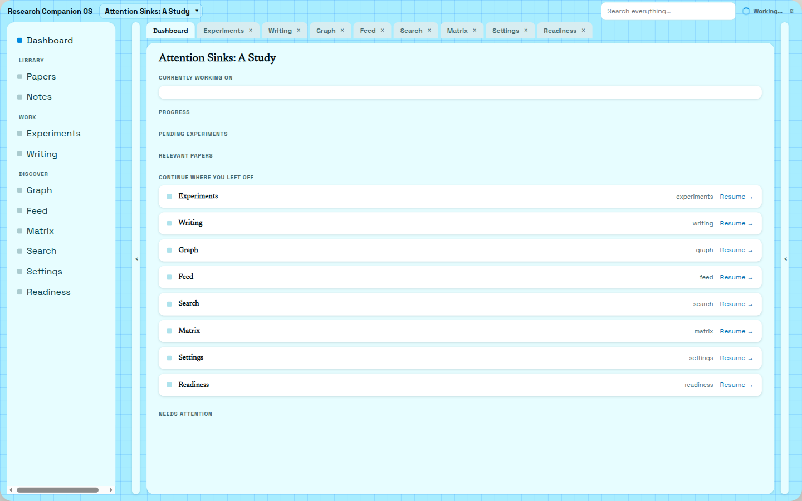
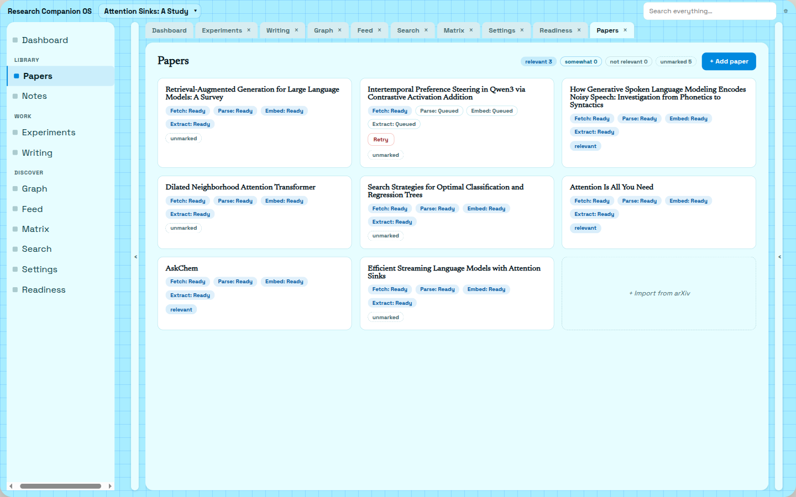
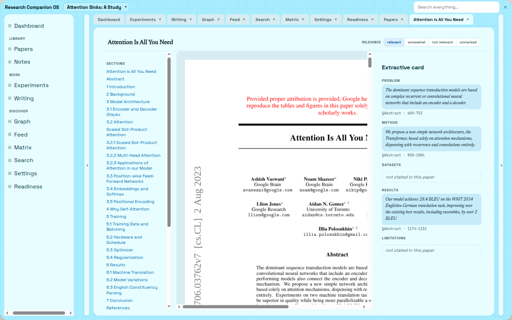
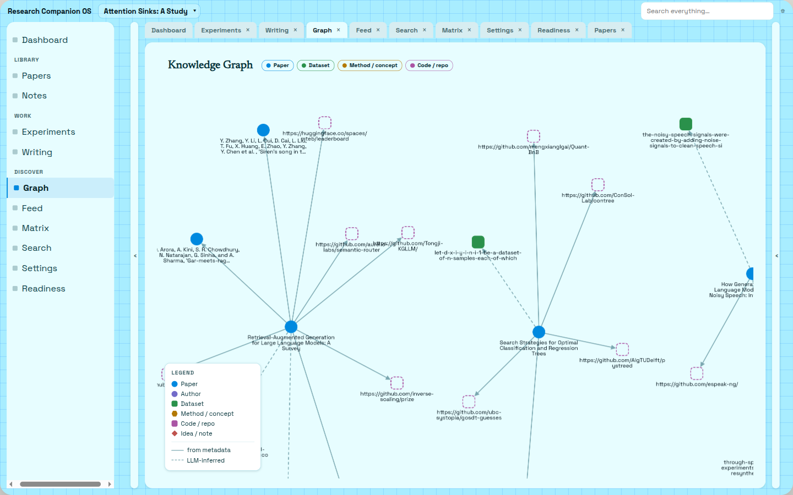
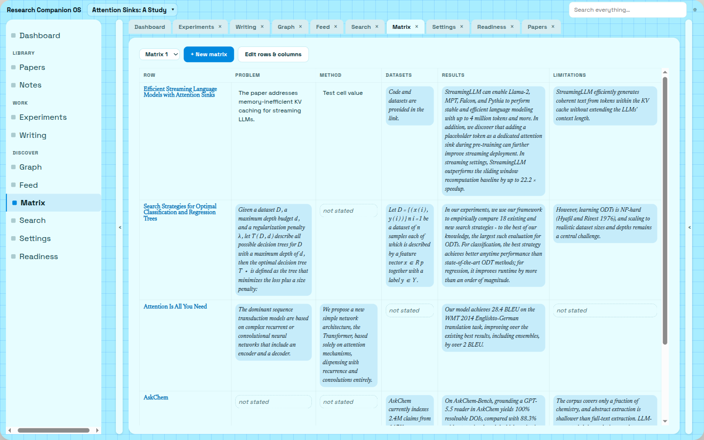
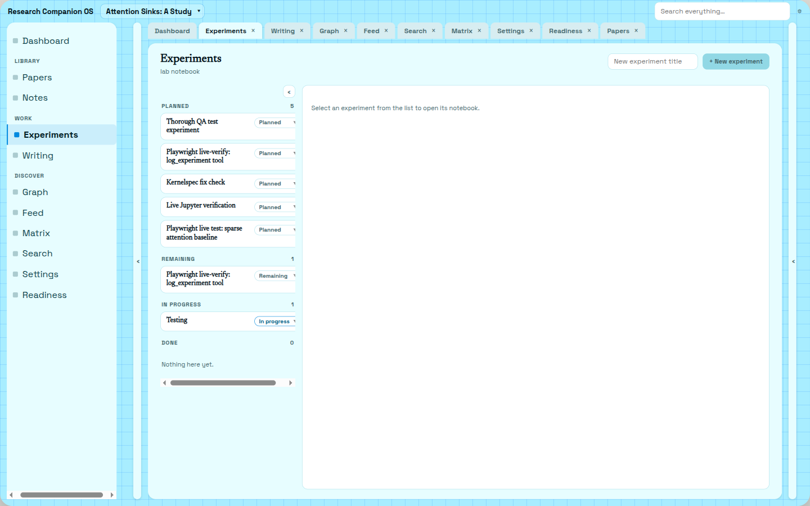

# AI-Powered-Research-Workspace

**Research Companion OS** — a local desktop workspace for doing all your research, without having
to waste time searching and organising knowledge.

Search the literature, read papers with an AI companion that cites its evidence, keep persistent
project memory, run experiments in a Docker sandbox you approve, and write it up — all against
plain files in a folder you own.

## What this is

Research Companion OS is a single-user, local-first desktop app for one researcher: an Electron
shell around a React frontend, supervising a Python (FastAPI) sidecar that does the real work —
search, retrieval, an agentic Companion, PDF parsing, and Docker-sandboxed code execution. Your
notes, PDFs, experiments, and manuscripts live as plain files in a vault folder you own; Postgres
is used only for machine-derived data (embeddings, indexes, caches) that can be rebuilt from the
vault at any time. It's built for a researcher who wants an AI that reads and remembers alongside
them without ever fabricating a citation or running code without permission — not a hosted product,
not a multi-user SaaS, not a writing assistant that drafts prose for you.

## Screenshots

All screenshots below are from a real, populated dev vault ("Attention Sinks: A Study" project) —
none are mocked.


*Dashboard — project stats and "continue where you left off" tabs for every open view.*


*Library — the project's paper collection with per-paper pipeline status (fetch/parse/embed/extract) and relevance marks.*


*Reader — the real PDF rendered via PDF.js alongside a section outline and an extractive card (Problem/Method/Datasets/Results/Limitations), each field a verbatim quote from the paper.*


*Knowledge Graph — papers, authors, datasets and code repos linked by metadata edges (solid) and LLM-inferred edges (dashed), rendered with Cytoscape.*


*Literature Matrix — a comparison table projected live from each paper's extractive card; "not stated" fields are shown honestly rather than guessed.*


*Experiments — the lab-notebook list (planned/remaining/in-progress/done) for the project's Docker-sandboxed experiment records.*

## Tech Stack

The backend and its AI/agent layer are where almost all of the engineering lives — the frontend is
a straightforward renderer by comparison, so it's listed last and in less depth.

### AI / Agent layer (`backend/harness/`, `backend/memory/`, `backend/provenance/`)

| Capability | Technology |
|---|---|
| LLM provider abstraction | **LiteLLM** — one `complete()` call across 100+ providers (Groq, OpenAI, Mistral, Ollama, vLLM, ...), swappable per user without touching app code |
| Agent runtime | **Custom-built harness** (`backend/harness/`, H1–H11) — tool-calling control loop, Pydantic-schema tool registry, budgeted context assembly with deterministic eviction, rolling conversation compaction, skills (on-demand playbooks), query-only subagents, an MCP bridge, crash-recovery/orphan-turn resume |
| Structured extraction | **Pydantic v2** schemas passed straight to the model — one source of truth for both the wire schema and the runtime validator, never hand-written twice |
| Embeddings | **`sentence-transformers`** running `Alibaba-NLP/gte-modernbert-base` — one fixed model for the whole app, never swapped per-provider (a hard invariant, D14) |
| Reranking | **Cross-encoder** `cross-encoder/ms-marco-MiniLM-L-6-v2` (`sentence-transformers`) — reranks both project-memory retrieval and literature search |
| Retrieval | Hybrid **dense (pgvector cosine) + lexical (Postgres `tsvector`/BM25)** search, fused and cross-encoder reranked |
| Citation validation | **Custom provenance engine** — every `<cite>` span the model emits is checked byte-for-byte against the real source text before it reaches the screen; a claim that fails renders as `⚠ unverified`, never silently trusted |
| Streaming | A hand-built **three-state streaming machine** (`backend/harness/streaming.py`) — prose streams to the UI immediately, only quoted spans buffer for validation, so citation-checking never costs the whole response its latency |
| PDF → structured text | **`docling`** — PDF to sections, references, and figures, feeding both the extractive card and the citation-check index |
| Notebook execution | **`nbformat`/`nbclient`** driving a real Jupyter kernel inside a **Docker**-sandboxed, network-off-by-default container — the only source of `measured` experiment metrics, gated behind explicit human approval |
| Tool extensibility | **MCP (Model Context Protocol)** bridge — a hand-rolled, dependency-free JSON-RPC client (stdio + HTTP/SSE transports) that turns any MCP server's tools into registry tools at runtime |

### Backend core (`backend/`)

| Layer | Technology |
|---|---|
| Language / runtime | **Python 3.11+**, managed with **`uv`** |
| API framework | **FastAPI** + **Uvicorn** (ASGI), real-time turns over **WebSocket** |
| ORM / DB access | **SQLAlchemy 2.0** (async) + **`asyncpg`** |
| Migrations | **Alembic** |
| Datastore | **PostgreSQL 16 + `pgvector`** — the only datastore, used strictly for machine-derived, rebuildable data |
| Job queue | **SAQ** — Postgres-backed background jobs, no Redis dependency |
| Secrets | OS **`keyring`** + **`cryptography`** (AES-256-GCM) — provider keys are never stored in plaintext |
| Container orchestration | **Docker SDK for Python**, driving the experiment-sandbox and LaTeX-compile containers |

### Frontend & desktop shell

| Layer | Technology |
|---|---|
| Framework | **React 18** + **TypeScript**, built with **Vite 6** |
| Server state | **TanStack Query** |
| Routing | **React Router 7** |
| Code editor | **CodeMirror 6** — one editor for both notebook cells and LaTeX |
| Knowledge graph | **Cytoscape** (`react-cytoscapejs`) |
| PDF rendering | **`pdfjs-dist`** |
| Math / diagrams | **KaTeX**, **Mermaid** |
| Desktop shell | **Electron** (main + preload only — spawns and supervises the Python sidecar, owns the window; ~zero business logic lives here) |

### Infra & tooling

**Docker Compose** (Postgres+pgvector locally; also hosts the sandboxed experiment and Tectonic-LaTeX containers) · **npm workspaces** monorepo · a generated **TypeScript API client** (`packages/api-client`) from the backend's OpenAPI schema, so a backend field rename becomes a frontend compile error, not a runtime bug.

## Key features

Status legend: ✅ Done · 🚧 Partial/stubbed · 📋 Planned

| Area | Status | Notes |
|---|---|---|
| **Search & Library** | ✅ | Federated search across arXiv/OpenAlex/Semantic Scholar (Firecrawl-ranked when a key is configured, deterministic lexical fallback otherwise), deduped and reranked. Add a paper to a project and mark relevance with your own note — content is fetched/parsed once and shared across projects, relevance is per-project. |
| **Reader & Companion** | ✅ | Real PDF via PDF.js with a validated extractive card (verbatim, offset-checked quotes). Select text for "Ask about this" / Highlight / Explain — the Companion answers over WebSocket with every factual claim backed by an inline citation; a claim that fails validation renders as `⚠ unverified` rather than being trusted. |
| **Project memory** | ✅ | Notes, papers, experiments, and past conversations are chunked/embedded into a project-scoped hybrid (dense + lexical) index, cross-encoder reranked, and cited by source row. |
| **The Harness (agent loop)** | ✅ | `backend/harness/` — the agent runtime behind every Companion turn: tool registry with schema-from-Pydantic validation, budgeted context assembly with deterministic eviction, rolling conversation-summary compaction, a cite-aware streaming state machine (prose streams live, only quoted spans buffer for validation), a human-approval gate for risky actions (e.g. running an experiment), skills (playbooks the model loads on demand), query-only subagents for wide research tasks, an MCP bridge for external tools, and crash-recovery (orphaned-turn resume). Built and shipped across phases H1–H11; see `PLANNER/HarnessPlan.md`. |
| **Experiments Sandbox** | ✅ | Structured experiment records (hypothesis/setup/metrics/notes/status) backed by real Docker execution: a one-shot "restart & run all" in an isolated, network-off-by-default container produces the only `source: measured` metrics, gated behind an explicit human confirmation token; a separate long-lived container runs a real embedded Jupyter server for interactive, out-of-order exploration (not evidential). The agent can propose a cell; it can never execute one on its own. |
| **Knowledge Graph** | ✅ | Metadata edges (cites/cited-by, uses-dataset, has-code) from literature APIs plus LLM-derived edges (method/dataset mentions) for opened papers, rendered as an interactive Cytoscape graph. The project-scoped `idea_edges` table (notes/experiments/highlights) is schema-complete but has no write path yet — that half of the graph is currently always empty. |
| **Literature Matrix** | ✅ | A live projection of each paper's extractive card (Problem/Method/Datasets/Results/Limitations) plus custom per-paper extractive columns, cached after first run. Cell edits are tracked as user overrides without corrupting the underlying extraction. |
| **Writing (LaTeX)** | ✅ | A `.tex` document per project, mirrored to the vault. Compiles via a sandboxed, offline Tectonic-in-Docker container (SwiftLaTeX/WASM live preview is designed but not the shipped compile path today); a citation checker flags missing and unsupported claims. The AI never drafts prose — it checks and organizes only. |
| **Research Feed** | ✅ | A scheduled, catch-up-on-launch poller: interest profile (seeded from a project's focus, editable) → category-driven fetch across arXiv/OpenAlex/S2 → deterministic keyword + centroid-cosine + cross-encoder scoring → dedup against a seen-set. No LLM in the ranking path. |
| **Voice** | 🚧 Stubbed | Push-to-talk is wired end-to-end in the UI and routes through the same Companion turn a typed message would, but the speech-to-text/text-to-speech engines are stubs (canned text / silence) — `faster-whisper`/Piper are not yet wired in. The module boundary and transport are real. |

## Architecture note

The system is local-first by decision, not by accident: an Electron shell supervises a Python
sidecar that does all the real work, the vault folder on disk is truth for anything you author
(notes, PDFs, code, manuscripts), and Postgres+pgvector is the only datastore — used strictly for
machine-derived, rebuildable data (embeddings, search caches, structured extraction). There is no
hosted deployment, no multi-tenancy, and no external services besides the literature APIs and
whatever LLM endpoint you configure. See `PLANNER/DECISIONS.md` for the authoritative record of
every architectural decision (D1–D37) and why each one was made.

## Installation / Getting started

**Prerequisites:** Docker, Python 3.11+ with [`uv`](https://docs.astral.sh/uv/), Node 20+.

### One-time setup

```bash
cd backend && uv sync && cp .env.example .env && cd ..
cd frontend && npm install && cp .env.development.example .env.development.local && cd ..
npm install   # root workspaces (frontend, desktop, api-client)
```

Then paste a key into `backend/.env` (see "Give it a model to test with" below) and run
`uv run --project backend python scripts/configure_provider.py`.

### Run everything: one command

```bash
npm start
```

From the repo root. This builds the frontend, launches the Electron desktop app, which in turn
spawns the Python backend as its sidecar — bringing up Postgres in Docker, running migrations,
and starting the API — and loads the built frontend into the app window. Closing the window stops
the backend (and the Docker container) with it.

Prefer separate terminals with hot-reload instead? Use the steps below.

### 1. Backend

```bash
cd backend
uv sync
cp .env.example .env
uv run python main.py
```

Brings up Postgres in Docker, runs migrations, starts the API on port `41500`. Keep it running.

Auto-reload on save instead:

```bash
uv run uvicorn main:app --reload --host 127.0.0.1 --port 41500
```

### 2. Give it a model to test with

Paste a key into `backend/.env`, then run the config script:

```bash
GROQ_API_KEY=gsk_...   # free key: https://console.groq.com/keys
```

```bash
uv run python scripts/configure_provider.py
```

Other providers: `configure_provider.py openai gpt-4.1-mini` with `OPENAI_API_KEY` set. Local
GPU: set `OLLAMA_BASE_URL` in `.env`, then `configure_provider.py ollama` — no key needed.

### 3. Frontend

```bash
cd frontend
cp .env.development.example .env.development.local
npm install
npm run dev
```

Open the printed URL.

### Or: the desktop app

`npm run dev:desktop` from the repo root — launches Electron, which starts the backend itself and
loads the frontend from `frontend/dist` (run `npm run build:frontend` first, or just use
`npm start` above, which does both).

## Testing

```bash
BEARER_TOKEN=devtoken PYTHONPATH=backend uv run --project backend pytest tests/ -q
```

If you also start the real sidecar (`uv run python main.py`) against an
existing vault while testing or smoke-checking — not just the deterministic
suite above — set `SKIP_JOB_CATCHUP=1` in `backend/.env` first. A vault
idle long enough owes overdue scheduled jobs, and two of them (feed poll,
interest-profile re-extraction) call the LLM; without this flag, the
moment the process connects it replays the whole backlog against whatever
provider is configured, including a real one. See `.env.example`.

## Project structure

```
backend/               FastAPI sidecar — harness, search, papers, experiments, sandbox, graph,
                        matrix, writing, feed, voice, memory index, vault writer, Docker orchestration
frontend/               Vite + React renderer — one screen per view (library, reader, graph, matrix,
                        experiments, writing, feed, dashboard, companion, settings)
desktop/                Electron main + preload — launcher/supervisor only, no logic
packages/api-client/    TypeScript client generated from FastAPI's OpenAPI schema
docker/                 docker-compose.yml (Postgres+pgvector) plus the sandbox/Tectonic Dockerfiles
PLANNER/                Architecture decisions, PRD, harness plan, UI design, and other planning docs
```

## Docs / further reading

- [`PLANNER/DECISIONS.md`](PLANNER/DECISIONS.md) — the authoritative architecture record (D1–D37):
  scope, stack, the harness, retrieval, execution sandbox, frontend shape, onboarding, voice.
- [`PLANNER/PRD.md`](PLANNER/PRD.md) — the user-facing feature list and phase breakdown.
- [`PLANNER/HarnessPlan.md`](PLANNER/HarnessPlan.md) — the agent harness rebuild plan (H1–H11):
  context budgeting, streaming, skills, subagents, MCP, approvals, crash recovery.
- [`PLANNER/UI_DESIGN.md`](PLANNER/UI_DESIGN.md) — look-and-feel: palette, type ramp, component shape.
