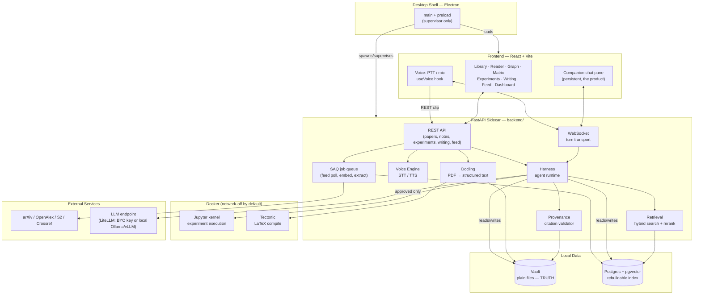
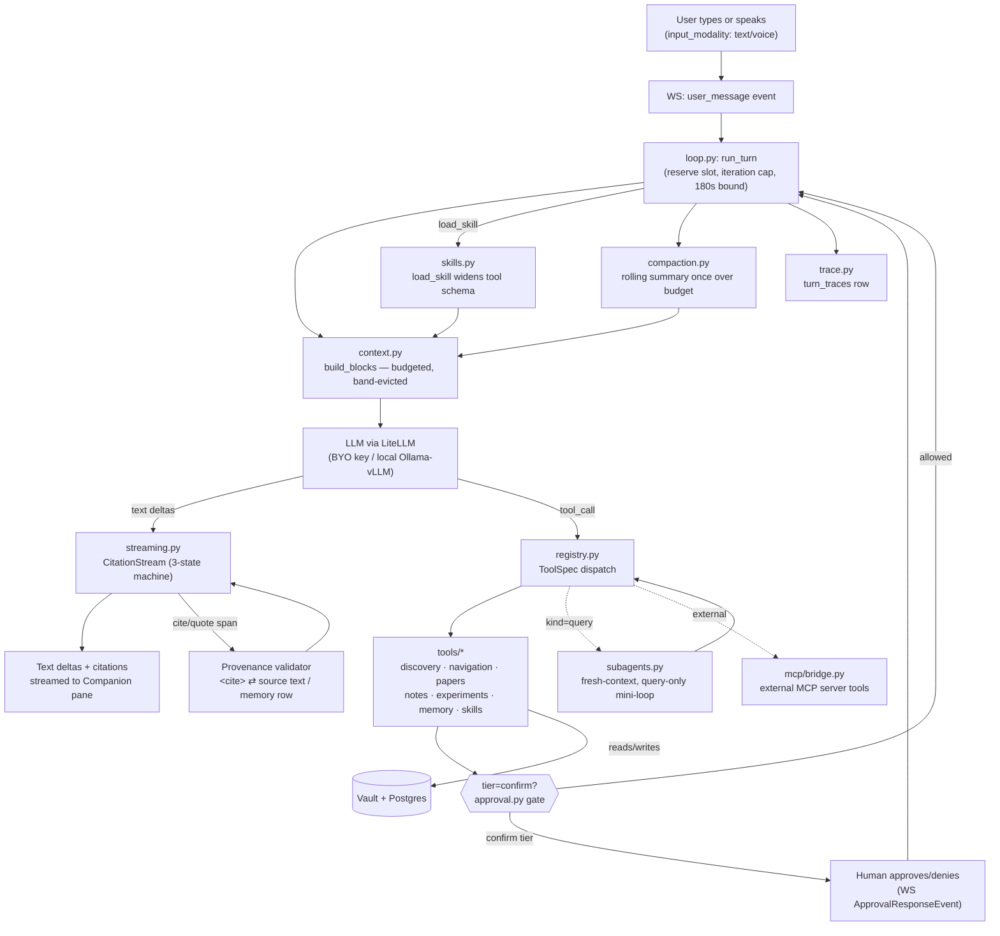
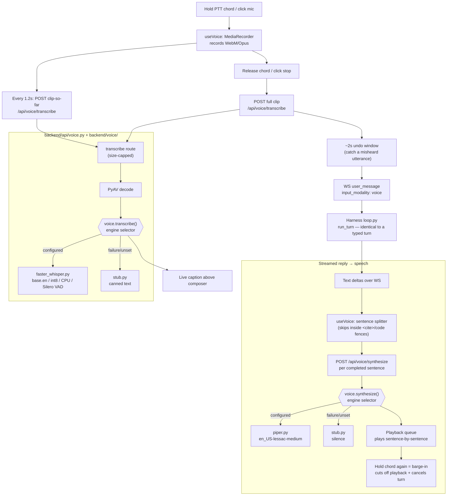

# System Architecture

This doc explains **Research Companion OS** at three zoom levels: the overall project, the
**Harness** (the agent runtime), and the **Voice** layer. Each section has a component table and
a Mermaid diagram. See `README.md` for setup and `PLANNER/` for the original decision docs.

---

## 1. Overall Project

A local-first desktop app: an Electron shell around a React UI, driving a Python/FastAPI sidecar
that does all the real work against plain files (the vault) and a local Postgres index. No
hosting, no auth, no multi-user, no external services besides literature APIs and whichever LLM
endpoint the user configures.

| Component | Role | Notes |
|---|---|---|
| **Electron shell** (`desktop/`) | Launches and supervises the Python sidecar, owns the app window | Main + preload only — near-zero business logic |
| **React frontend** (`frontend/`) | One screen per view: library, reader, graph, matrix, experiments, writing, feed, dashboard, companion, settings | Talks to the sidecar over REST + one WebSocket |
| **FastAPI sidecar** (`backend/`) | Search, retrieval, the agentic Companion (Harness), PDF parsing, voice, Docker-sandboxed execution | The "fat backend" — almost all engineering lives here |
| **Vault (plain files)** | Notes, PDFs, experiment records, `.tex` manuscripts | **Source of truth** — the app is its sole writer, no file watcher |
| **Postgres + pgvector** | Embeddings, hybrid search index, structured extraction cache, job queue | Machine-derived data only — always rebuildable from the vault |
| **Docker sandbox** | Jupyter-kernel experiment execution, Tectonic LaTeX compile | Network-off-by-default; agent never runs code without explicit human approval |
| **External APIs** | arXiv / OpenAlex / Semantic Scholar / Crossref / Firecrawl (optional) | Literature search and metadata only — never paywalled PDF scraping |
| **LLM endpoint** | Whatever the user configures via LiteLLM (BYO key or local Ollama/vLLM) | Never Claude Pro/Max or ChatGPT/Codex subscriptions — no API surface, ToS-forbidden |

### Diagram

---

## 2. The Harness (Agent Loop)

The custom-built agent runtime behind every Companion turn (`backend/harness/`). Pure
tool-calling agent — no hardwired fast path. Fat backend, thin frontend: the frontend only
renders what the harness streams.

| Module | Responsibility |
|---|---|
| `loop.py` | The control loop: reserves the in-flight slot, calls the LLM, dispatches tool calls, validates citations, persists the transcript. Hard iteration cap + 180s wall-clock bound |
| `context.py` | Assembles `llm_messages` inside a fixed token budget; deterministic band-based eviction (system prompt/tool schemas/open-paper evidence never evict) |
| `registry.py` | The `@tool` decorator + `ToolSpec` + dispatch — JSON schema generated once from each tool's Pydantic model, same model validates every call |
| `tools/` | The tool catalog: discovery, navigation, papers, notes, experiments, memory, skills, research |
| `streaming.py` | `CitationStream` — a 3-state machine: prose streams to the UI immediately, only a `<cite>` span buffers for validation |
| Citation validation | Every `<cite>` tag is re-verified byte-for-byte against the source text or a `query_memory` row; a claim that fails renders `⚠ unverified`, never trusted on the model's say-so |
| `compaction.py` | Rolling conversation-summary compaction once history grows past budget |
| `approval.py` | Human-approval gate for `tier="confirm"` tools (e.g. running an experiment) — a pending-future dict resolved by a WS response |
| `subagents.py` | Query-only, fresh-context mini-loops for wide research tasks — no conversation history, cannot mutate, never streams prose |
| `skills.py` / `skills/*.md` | On-demand playbooks the model loads mid-turn, widening its visible tool schema for that turn only |
| `mcp/` | MCP bridge — turns any configured MCP server's tools into registry tools at runtime; always `tier="confirm"`, always `kind="action"` |
| `resume.py` | Crash-recovery: resumes an orphaned turn left in-flight by a sidecar restart |
| `trace.py` | Per-turn observability row (`turn_traces`) |

### Diagram

---

## 3. Voice Agent

A thin transport over the *same* Harness tool layer (D36–D37) — voice never gets its own agent
logic. Local-only engines behind one swappable module boundary: `faster-whisper` for STT, Piper
for TTS. A typed turn and a spoken turn are indistinguishable to the harness; only
`input_modality` on the wire tags how it arrived.

| Component | Responsibility |
|---|---|
| `frontend/src/voice/pttBinding.ts` | Rebindable push-to-talk key chord (default `Ctrl+Shift`) |
| `frontend/src/voice/useVoice.ts` | Recording, live-caption polling (1.2s re-transcribe of the growing clip), 2s undo window before send, sentence-splitting + queued playback of the streamed reply, barge-in |
| `POST /api/voice/transcribe` (`backend/api/voice.py`) | Route glue only — audio bytes in, `Transcript` out |
| `POST /api/voice/synthesize` (`backend/api/voice.py`) | Text in, WAV audio out, called once per completed sentence as the reply streams |
| `backend/voice/__init__.py` | Engine selection + fallback boundary — the **only** module allowed to import an STT/TTS library |
| `backend/voice/faster_whisper.py` | Real STT: `base.en`, int8, CPU, Silero VAD |
| `backend/voice/piper.py` | Real TTS: `en_US-lessac-medium` |
| `backend/voice/stub.py` | Canned text / silence — same interface, used before real engines are wired or on failure |
| `backend/voice/weights.py` | Background pre-fetch of model weights on first launch (app stays usable while downloading) |
| PyAV | Decodes whatever codec the browser's `MediaRecorder` produced |
| `backend/ws/__init__.py` | Carries the transcribed text into the **same** `user_message` → `run_turn` path as a typed message, tagged `input_modality: "voice"` |

### Diagram

---

## Tech Stack

| Tech Stack | Used Where | Why |
|---|---|---|
| **Electron** | `desktop/` — main + preload | Cross-platform desktop shell that supervises the Python sidecar; kept to near-zero logic on purpose |
| **React 18 + TypeScript** | `frontend/src/` — all views | Type-safe UI; TS types shared with the backend via the generated API client |
| **Vite 6** | Frontend build/dev server | Fast HMR for a large multi-view SPA |
| **TanStack Query** | Frontend server-state (papers, notes, experiments, etc.) | Caching/invalidation for REST reads without hand-rolled state |
| **React Router 7** | Frontend routing between views | Standard SPA routing |
| **Zustand** | Frontend client-only state | Lightweight store for UI state the WebSocket bus needs to read/write bidirectionally |
| **CodeMirror 6** | Notebook cells + LaTeX editor (`writing/`, `experiments/`) | One editor component reused for both code and `.tex` |
| **Cytoscape** (`react-cytoscapejs`) | Knowledge Graph view | Interactive graph rendering for metadata + LLM-inferred edges |
| **PDF.js** (`pdfjs-dist`) | Reader view | Real PDF rendering with text-layer quote anchoring, not an image preview |
| **KaTeX / Mermaid** | Writing & note rendering | Math typesetting and diagrams inline in notes/manuscripts |
| **Python 3.11+ / `uv`** | `backend/` runtime + dependency management | Modern, fast, reproducible Python env management |
| **FastAPI + Uvicorn** | `backend/api/`, `backend/main.py` | ASGI framework for REST + WebSocket in one process |
| **WebSocket** | Companion turns, voice turns | Real-time bidirectional streaming for agent replies and UI-state sync |
| **SQLAlchemy 2.0 (async) + `asyncpg`** | All DB access | Async ORM matched to FastAPI's async model |
| **Alembic** | `backend/alembic/` | Schema migrations for the Postgres index |
| **PostgreSQL 16 + `pgvector`** | Sole datastore (Docker) | Dense vector search (pgvector) + lexical search (`tsvector`) in one engine; strictly a rebuildable index, never the source of truth |
| **SAQ** | `backend/jobs/` | Postgres-backed background job queue (feed poll, embedding, extraction) — no Redis dependency |
| **LiteLLM** | `backend/llm/` | One `complete()` call across 100+ providers (Groq, OpenAI, Mistral, Ollama, vLLM…), swappable per user with zero app-code changes |
| **Pydantic v2** | Tool schemas, wire models, structured extraction | Single source of truth for both JSON schema and runtime validation — never hand-written twice |
| **`sentence-transformers`** (`gte-modernbert-base`) | `backend/memory/embedder.py` | Fixed embedding model (invariant, D14) — swapping it silently invalidates every vector in the index |
| **Cross-encoder** (`ms-marco-MiniLM-L-6-v2`) | `backend/search/reranker.py`, memory retrieval | Reranks both literature search and project-memory retrieval after hybrid fusion |
| **`docling`** | PDF → structured text pipeline | Extracts sections/references/figures feeding the extractive card and citation-check index |
| **`nbformat` / `nbclient`** | Experiments sandbox | Drives a real Jupyter kernel for both interactive exploration and evidential "measured" runs |
| **Docker + Docker SDK for Python** | Experiment sandbox, Tectonic LaTeX compile | Hard invariant: all code execution is sandboxed, no opt-out (D30); network-off-by-default containment |
| **MCP (Model Context Protocol)** | `backend/harness/mcp/` | Dependency-free JSON-RPC bridge (stdio + HTTP/SSE) turning external MCP servers into registry tools at runtime |
| **`faster-whisper`** | `backend/voice/faster_whisper.py` | Local, CPU-viable STT (`base.en`, int8) with Silero VAD — no cloud speech API, keeps voice local-first |
| **Piper** | `backend/voice/piper.py` | Local, CPU-viable TTS (`en_US-lessac-medium`) matching the same local-first constraint |
| **PyAV** | `backend/voice/` audio decode | Decodes whatever codec the browser's `MediaRecorder` produced before handing bytes to STT |
| **OS `keyring` + `cryptography` (AES-256-GCM)** | `backend/settings/` provider keys | Provider API keys never stored in plaintext |
| **Docker Compose** | `docker/` | Brings up Postgres+pgvector, sandbox, and Tectonic-LaTeX containers locally |
| **npm workspaces** | Repo root | Monorepo linking `frontend/`, `desktop/`, `packages/api-client/` |
| **Generated TS API client** (`packages/api-client`) | Frontend ⇄ backend contract | Generated from FastAPI's OpenAPI schema — a backend field rename becomes a frontend compile error, not a runtime bug |
